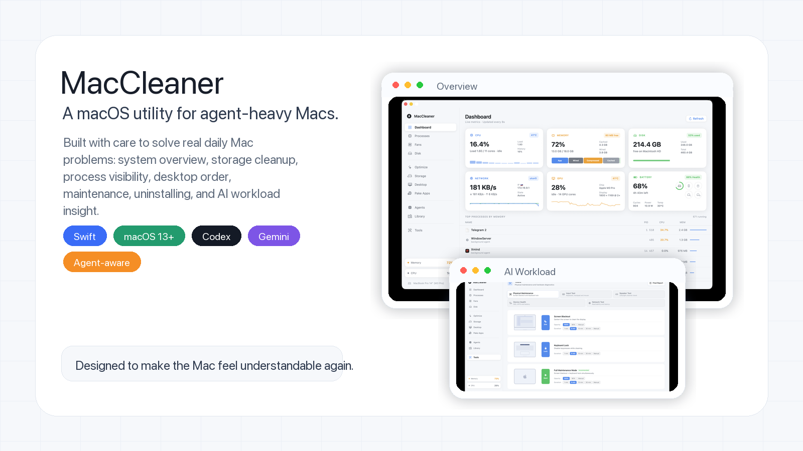
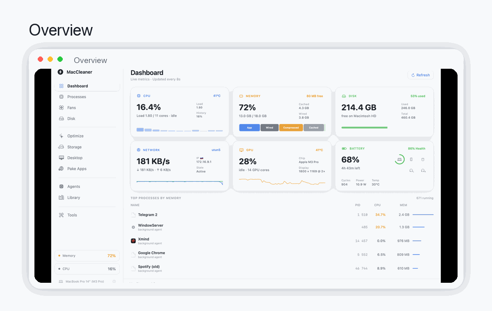
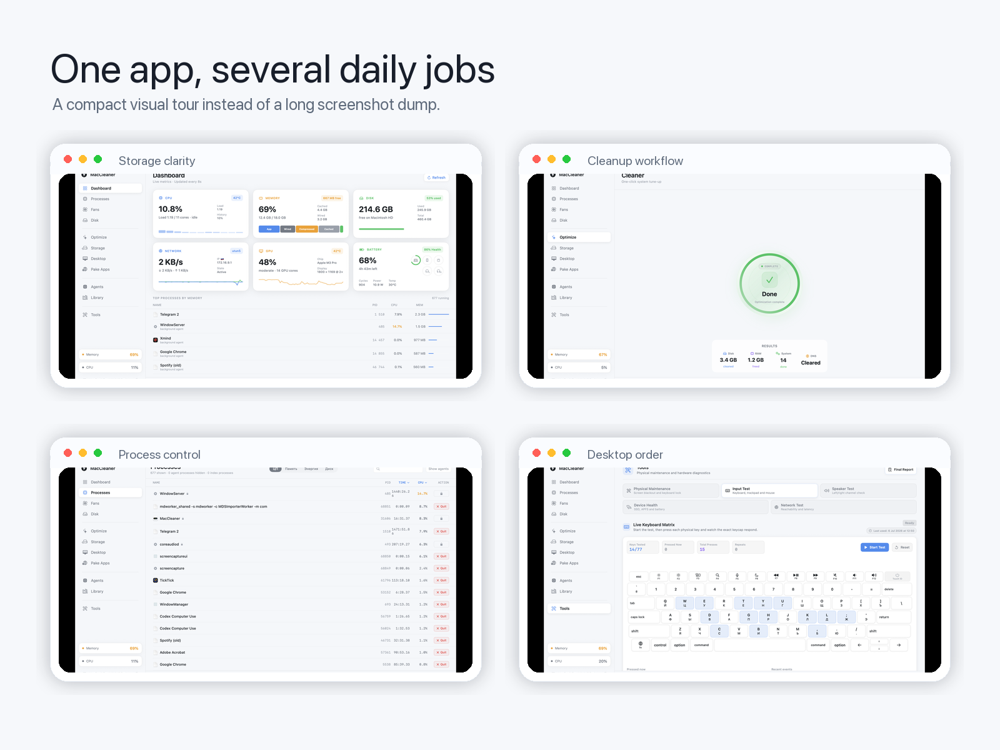
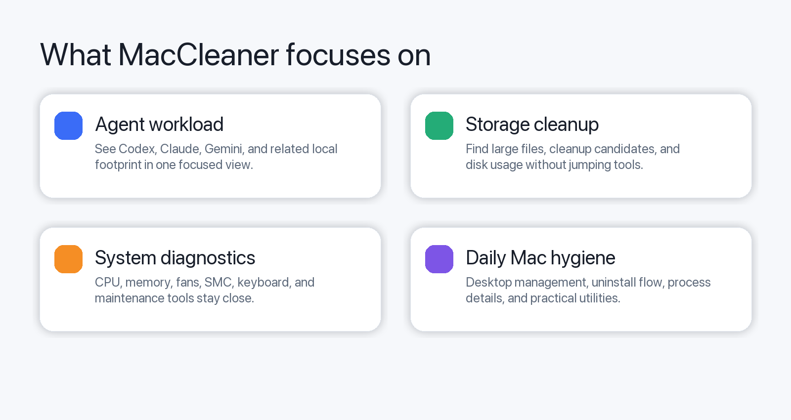

<p align="center">
  
</p>

<h1 align="center">MacCleaner</h1>

<p align="center">
  A native macOS utility for keeping an agent-heavy Mac understandable, clean, and ready to work.
</p>

<p align="center">
  
  
  
  
  
</p>

MacCleaner started as a practical answer to a personal problem: the more local tools, agents, helpers, caches, and experiments live on a Mac, the harder it becomes to see what is happening. The app is built with care for people who want one calm place to inspect the system, clean obvious clutter, understand agent workload, and use a few extra utilities without jumping between unrelated apps.

It is not only a cleaner. It includes storage analysis, process inspection, maintenance tools, desktop organization, uninstall support, hardware diagnostics, and AI-agent workload visibility.

## Visual Tour

<p align="center">
  
</p>

<details>
  <summary>Open the full visual overview</summary>

  <p align="center">
    
  </p>

  <p align="center">
    
  </p>
</details>

## Why It Exists

Modern Mac work can get noisy: developer tools, AI agents, browser apps, local caches, background processes, downloads, screenshots, desktop files, and old apps all compete for attention. MacCleaner is a focused control panel for that daily mess.

The design goal is simple: make the Mac feel readable again.

## Core Areas

| Area | What it helps with |
| --- | --- |
| Agent workload | Inspect local AI tooling footprint and activity around Codex, Claude, Gemini, and related processes. |
| Storage | Review disk usage, large files, cleanup candidates, and storage pressure. |
| Processes | See process details and resource usage without opening several system tools. |
| Maintenance | Run practical cleanup and maintenance actions from one place. |
| Desktop | Organize files and preview desktop clutter visually. |
| Uninstaller | Remove apps with supporting cleanup context. |
| Diagnostics | Check CPU, memory, fans, SMC, keyboard, battery, and thermal state. |

## Screenshots

The README uses a compact slideshow by default, so the page stays readable. Full raw screenshots are still available in [`docs/images`](./docs/images).

## Requirements

- macOS 13.0 or newer
- Xcode 15 or newer for local builds

## Build

Build a local Release DMG:

```bash
./scripts/build_dmg.sh
```

The script builds the app in Release mode, applies an ad-hoc signature, creates `release/MacCleaner.dmg`, and removes temporary build output.

For a plain Xcode build:

```bash
xcodebuild \
  -project MacCleaner.xcodeproj \
  -scheme MacCleaner \
  -configuration Release
```

## Install From DMG

The local release image is generated at:

```bash
release/MacCleaner.dmg
```

Open the DMG and drag `MacCleaner.app` into `Applications`.

The local DMG build is ad-hoc signed for local installation. It is not notarized with Apple Developer ID, so macOS Gatekeeper may require opening the app with right click, then `Open`.

## Repository Layout

```text
MacCleaner.xcodeproj/   Xcode project
MacCleaner/             Swift source, assets, and app configuration
docs/images/            Raw README screenshots
docs/readme-media/      Designed README visuals and slideshow
scripts/build_dmg.sh    Local DMG packaging script
release/                Ignored local release artifacts
```

## Distribution Notes

GitHub releases publish `release/MacCleaner.dmg` from the release workflow. The DMG is unsigned and the app bundle is ad-hoc signed, so macOS Gatekeeper may show an unknown developer warning on first launch. Open the app with right click, then `Open`.


<p>
  
</p>
<pre hspace="12">
   Telegram ······ <a href="https://t.me/Jas953/">t.me/Jas953</a>
   LinkedIn ······ <a href="https://www.linkedin.com/in/jas952/">linkedin.com/in/jas952</a>
   X        ······ <a href="https://x.com/not__jas">x.com/not__jas</a>
</pre>
<br clear="left" />
