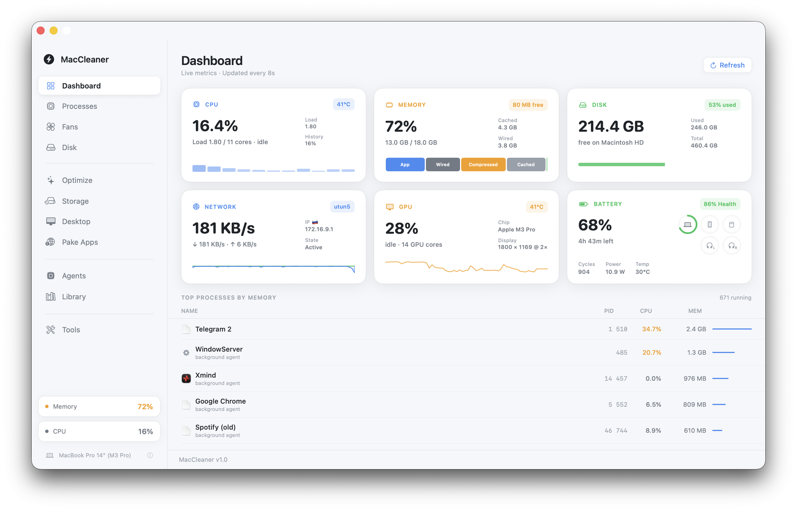
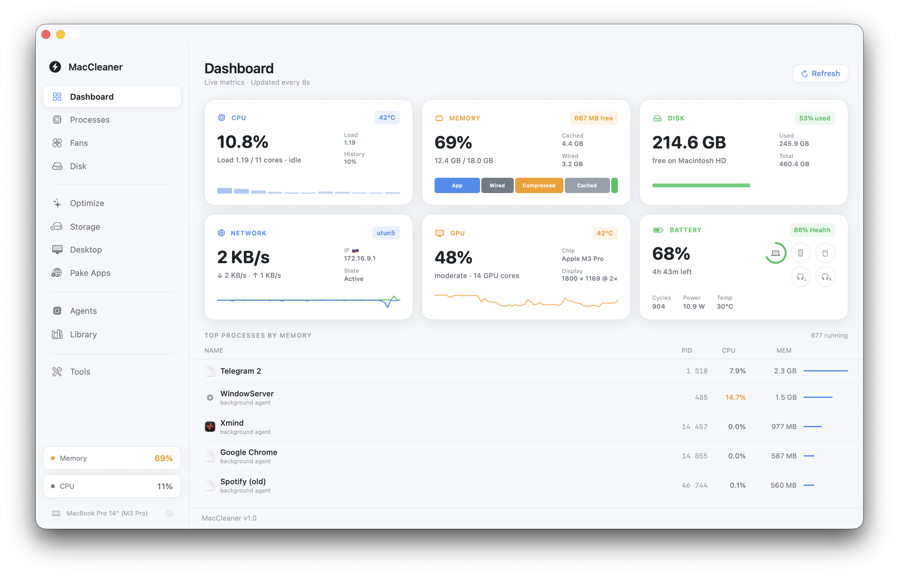
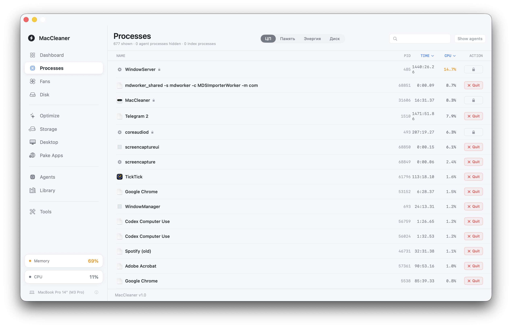
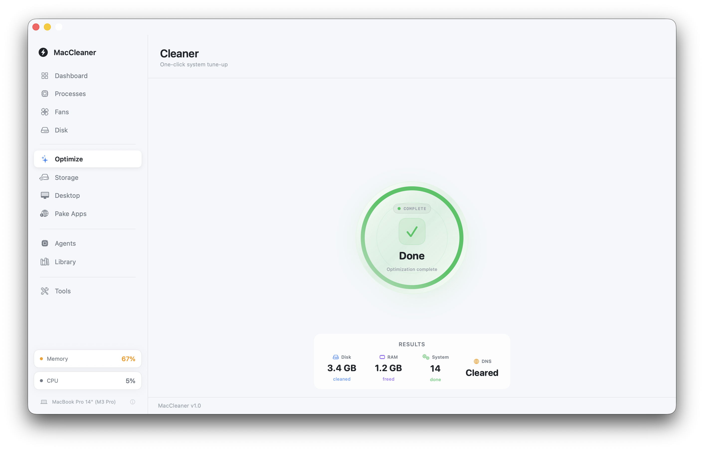
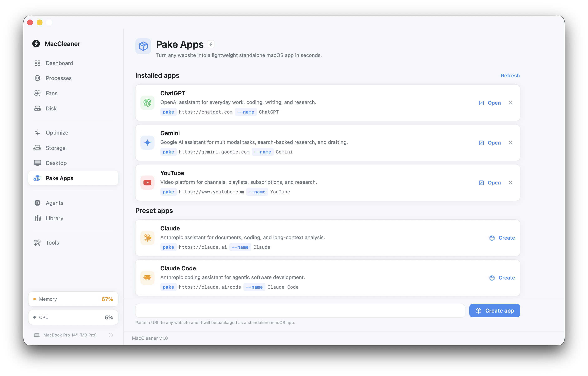
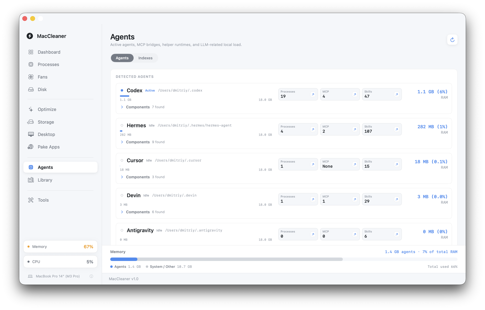
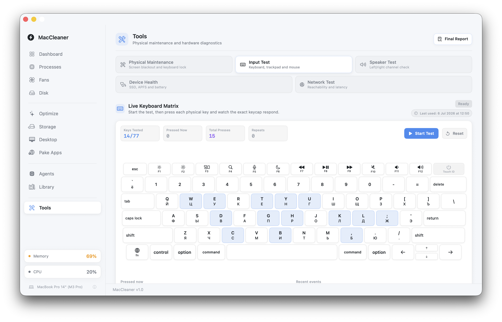
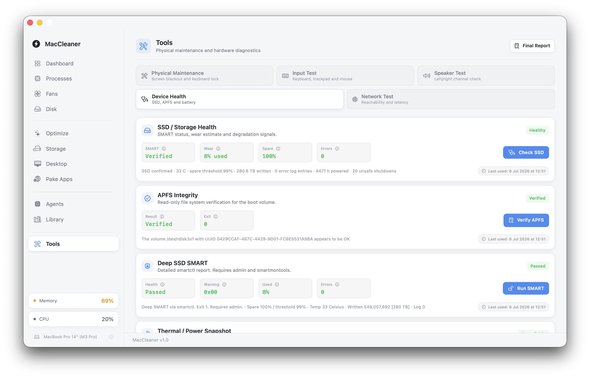

# MacCleaner

MacCleaner is a native macOS utility for monitoring system health, cleaning local clutter, inspecting storage, managing processes, and reviewing AI tooling workload on a Mac.



## Features

- System overview with CPU, memory, disk, battery, and thermal state.
- Storage analysis for large files, disk usage, and cleanup targets.
- Process inspection with process details and resource usage.
- Maintenance tools for common macOS cleanup tasks.
- Desktop organization and file previews.
- App uninstaller workflow.
- AI workload view for local agent/tooling footprint.
- Hardware, keyboard, fan, and SMC diagnostic views.

## Requirements

- macOS 13.0 or newer.
- Xcode 15 or newer for local builds.

## Install From DMG

The local release image is generated at:

```bash
release/MacCleaner.dmg
```

Open the DMG and drag `MacCleaner.app` into `Applications`.

The local DMG build is ad-hoc signed for local installation. It is not notarized with Apple Developer ID, so macOS Gatekeeper may require opening the app with right click, then `Open`.

## Build

Build a local Release DMG:

```bash
./scripts/build_dmg.sh
```

The script builds the app in Release mode, applies an ad-hoc signature, creates `release/MacCleaner.dmg`, and removes temporary build output.

For a plain Xcode build:

```bash
xcodebuild \
  -project MacCleaner.xcodeproj \
  -scheme MacCleaner \
  -configuration Release
```

## Screenshots

| Overview | Storage | Processes |
| --- | --- | --- |
|  |  |  |

| Cleaner | Maintenance | Uninstaller |
| --- | --- | --- |
|  |  |  |

| AI Workload | Desktop | Settings |
| --- | --- | --- |
|  |  |  |

## Repository Layout

```text
MacCleaner.xcodeproj/   Xcode project
MacCleaner/             Swift source, assets, and app configuration
docs/images/            README screenshots
scripts/build_dmg.sh    Local DMG packaging script
release/                Ignored local release artifacts
```

## Distribution Notes

GitHub source releases can use the ignored `release/MacCleaner.dmg` as a manually uploaded release asset. Public distribution outside local testing should use a Developer ID certificate and Apple notarization.


<p>
  
</p>
<pre hspace="12">
   Telegram ······ <a href="https://t.me/Jas953/">t.me/Jas953</a>
   LinkedIn ······ <a href="https://www.linkedin.com/in/jas952/">linkedin.com/in/jas952</a>
   X        ······ <a href="https://x.com/not__jas">x.com/not__jas</a>
</pre>
<br clear="left" />
