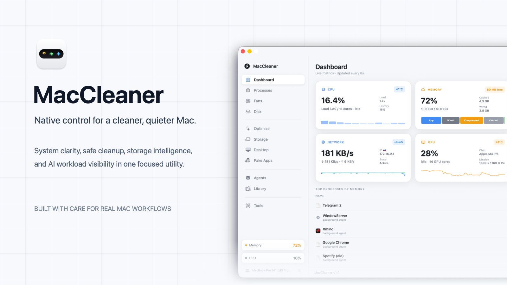
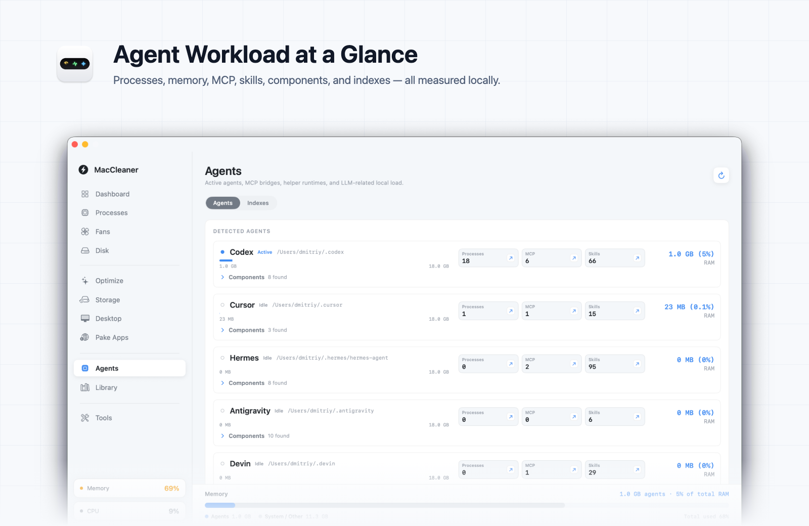

  

<h1 align="center">MacCleaner</h1>

  Native macOS utility for monitoring, cleaning and maintaining your Mac from one place.

  
  
  
  

  
  &nbsp;
  
  &nbsp;
  

 

## Overview

MacCleaner helps you understand what is happening on your Mac and clean unnecessary data without hiding the details.

It combines live system monitoring, storage analysis, safe cleanup, process inspection, AI workload visibility, and practical diagnostics in one native macOS app.

  
   
  

## Features

- **Live system dashboard** — monitor CPU, memory, disk, network, GPU, battery, temperatures, and the processes using the most resources. Key metrics are also available from the menu bar for quick access.
- **Process inspection** — search and sort running applications, inspect grouped processes and child activity, review CPU and memory usage, and quit regular applications directly from MacCleaner.
- **Cooling and hardware monitoring** — view fan speeds, temperature sensors, thermal history, battery information, disk health, APFS details, and available SMART data. Hardware support depends on the Mac model.
- **Safe cleanup and optimization** — analyze browser caches, logs, saved states, application data, developer leftovers, and local AI tool caches before removing anything. Results show paths, categories, item counts, sizes, and safety status.
- **Storage analysis** — find large files, exact duplicates, similar photos, application leftovers, junk data, and reclaimable local iCloud copies. A complete analysis can combine several storage checks into one reviewable workflow.
- **Cleanup history** — track reclaimed space, recurring cleanup targets, and rebuildable caches without counting the same temporary data as permanent savings multiple times.
- **Desktop management** — browse files with previews and metadata, rename or move items, create folders, and organize Desktop files into folders by type after confirmation.
- 
  — turn preset services or any website URL into a lightweight standalone macOS application, then open or remove generated apps from the same screen. Powered by the original Pake project.

- **Local AI workload** — detect supported agents, MCP servers, helper processes, skills, profiles, vector stores, model runtimes, and related local files. MacCleaner also attributes CPU and memory usage to the detected AI tools.

- 
  — compare local language models against the Mac's available hardware, then filter and sort them by memory requirements, speed, parameters, context length, capabilities, publisher, and use case. Model data and compatibility checks are provided through llmfit.

- **Utilities and diagnostics** — use the Drop Shelf, screen color picker, Homebrew maintenance tools, keyboard and pointer testing, speaker channel checks, physical cleaning mode, device health checks, and network latency tests.

## Local AI Workload

MacCleaner treats local AI tools as part of the system workload.

The Agents view shows which tools are active, how many resources they use, and what local components belong to them.

  

## Install

1. Download the latest `.dmg` from [Releases](https://github.com/Jas952/MacCleaner/releases/latest).
2. Open it and drag `MacCleaner.app` into `Applications`.
3. Launch MacCleaner.

> [!NOTE]
> The current build is not notarized. If macOS blocks the first launch, right-click the app, choose **Open**, and confirm once.

## Requirements

- macOS 13.0 or newer
- Some scans may require Full Disk Access
- Fan, sensor and SMART data depend on the Mac model
- Some tools may require optional local CLI utilities

## Philosophy

MacCleaner is not a magic one-click cleaner.

It shows what it found, keeps potentially destructive actions visible, and uses bounded, cancellable scans so deeper analysis does not turn into uncontrolled full-disk work.

## Contact

  

<pre hspace="12">
   Telegram ······ <a href="https://t.me/Jas953/">t.me/Jas953</a>
   LinkedIn ······ <a href="https://www.linkedin.com/in/jas952/">linkedin.com/in/jas952</a>
   X        ······ <a href="https://x.com/not__jas">x.com/not__jas</a>
</pre>

 
