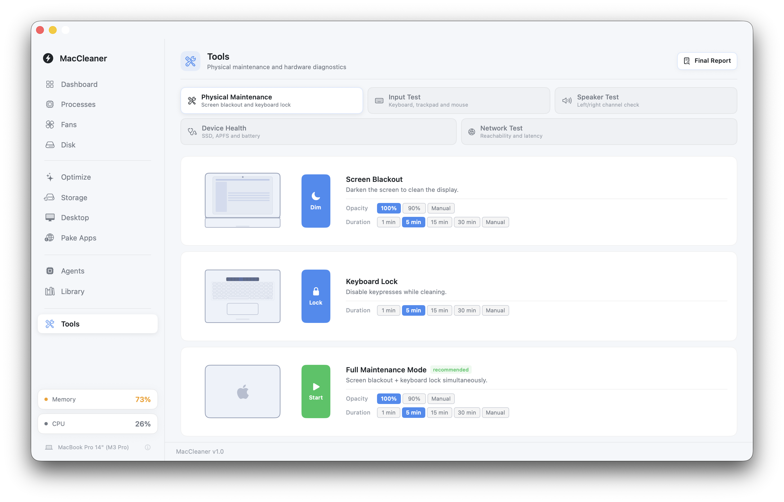

<p align="center">
  
</p>

<h1 align="center">MacCleaner</h1>

<p align="center">
  Native control for a cleaner, quieter, and more understandable Mac.
</p>

<p align="center">
  
  
  
</p>

<p align="center">
  
  
  
  
  
</p>

MacCleaner began with a personal problem: a Mac used for development and local AI agents gradually becomes difficult to read. Processes multiply, caches grow, storage fragments across tools, and useful maintenance actions end up scattered around the system.

The result is a native utility built with care for anyone who wants one calm place to understand the machine, recover space safely, inspect agent workloads, and reach practical diagnostics without switching between unrelated apps.

MacCleaner is more than a cleaner. It combines system monitoring, bounded storage analysis, safe cleanup, process inspection, app uninstalling, desktop organization, AI workload visibility, and a set of focused maintenance tools.

## Measured Results

The numbers below come from Release builds tested on the same Mac with the same toolchain. They measure engineering changes between v1.0 and the optimized architecture introduced in v1.1; v1.2 keeps those policies and extends the test barrier.

| Result | What was measured |
| --- | --- |
| **39/39 tests passing** | Current v1.2 safety and policy suite covering paths, Trash semantics, bounded scans, duplicates, similar photos, cloud reclaim, startup items, and process aggregation. |
| **94.2% fewer idle process snapshots** | Background process collection moved from every 105 seconds to every 1,800 seconds when no active screen needs it. |
| **3.5× fresher process data** | The Processes screen refresh interval improved from 105 seconds to 30 seconds while active. |
| **up to 33.3× more scan capacity** | Thorough storage scans increased the entry budget from 30,000 to 1,000,000 while retaining deadlines and cancellation. |
| **91.7% fewer external battery scans** | Expensive `system_profiler` collection moved from every 30 minutes to every 6 hours while idle. |
| **0 hard-delete fallbacks** | Migrated user-facing cleanup flows stop and report an error if Trash fails instead of permanently deleting the file. |

These are not synthetic “cleaner scores.” They describe cadence, scan capacity, safety policy, and regression coverage. The same comparison also recorded a larger v1.1 bundle and about 7.2% higher average launch RSS, so footprint remains a visible optimization target. See the [full measurement report](./docs/maccleaner-v1.0-vs-v1.1-summary.md).

## How It Works

| Area | Method |
| --- | --- |
| System monitoring | Reads Mach, IOKit, IORegistry, CoreGraphics, network interface, and mounted-volume data. Refresh cadence adapts to the active screen so expensive work is reduced in the background. |
| Storage analysis | Walks user-selected local roots with explicit entry and time budgets. Efficient and Thorough modes make the speed-versus-depth tradeoff visible and every long scan can be cancelled. |
| Safe cleanup | Normalizes paths, protects MacCleaner and system-sensitive locations, then uses macOS Trash. A failed Trash operation is surfaced to the user and does not become permanent deletion. |
| Exact duplicates | Groups candidates by metadata, applies a quick fingerprint, then proves matches with full SHA-256 only where needed. Hard links and changed files are rechecked before cleanup. |
| Similar photos | Creates private 512 px ImageIO/Vision feature prints locally. Visual matches are reviewed by the user and revalidated before selected copies move to Trash. |
| App removal | Finds the application and related user-space support files, presents them for review, and routes selected items through the same safe deletion policy. |
| Startup optimization | Inspects LaunchAgents and allows reversible disable/restore while protecting Apple and MacCleaner entries. |
| AI workload analysis | Correlates running processes with known local agents, profiles, MCP configurations, skills, components, and local index stores. |

## Application Demo

<p align="center">
  <br />
  
</p>

<details>
  <summary><strong>Open the full interface gallery</strong></summary>

  <p align="center">
    
  </p>
</details>

## AI Workload, Made Visible

MacCleaner treats local AI tooling as part of the system workload, not as an abstract badge. The Agents area identifies supported agent processes, groups their resource use, and inspects local MCP, skills, component, profile, and index-store footprints.

This helps answer practical questions: which agent is active, how much CPU and memory it is using, which local integrations are present, and where related workload data lives. Analysis stays on the Mac; availability depends on the tools and permissions present on that machine.

<p align="center">
  
</p>

## More Than Cleanup

| Tool | What it adds |
| --- | --- |
| Cleanup Advisor | Ranks reclaim opportunities by size, risk, and recovery cost. |
| Complete Analysis | Runs Advisor, Exact Duplicates, Similar Photos, and Cloud Reclaim as one bounded workflow with a combined result. |
| Cloud Reclaim | Evicts only the local copy of confirmed iCloud files without deleting their cloud copy. |
| Desktop Manager | Offers grid, list, column, and canvas views with preview, rename, move, organization, and Trash actions. |
| Process and window inspector | Groups app instances, exposes individual PIDs and metrics, and associates visible windows through CoreGraphics. |
| Hardware diagnostics | Covers storage health, APFS, SMART when available, thermals, fans, network, keyboard, pointer, and speakers. |
| Pake Apps and LLM Library | Adds optional workflows powered by locally installed `pake` and `llmfit` command-line tools. |
| Updates | Uses Sparkle with an HTTPS, EdDSA-signed appcast for manual and background update checks. |

## Install

Download the current DMG from [GitHub Releases](https://github.com/Jas952/MacCleaner/releases/latest), open it, and drag `MacCleaner.app` into `Applications`.

The public build is currently ad-hoc signed rather than Apple-notarized. On first launch, macOS may require right-clicking the app and choosing `Open`. Some inspections require Full Disk Access; hardware-specific diagnostics depend on the Mac and available system tools.

### Build From Source

Requirements: macOS 13.0 or newer and Xcode 15 or newer.

```bash
git clone https://github.com/Jas952/MacCleaner.git
cd MacCleaner
./scripts/build_dmg.sh
```

The local image is created at `release/MacCleaner.dmg`. To build directly in Xcode:

```bash
xcodebuild \
  -project MacCleaner.xcodeproj \
  -scheme MacCleaner \
  -configuration Release
```

## Project Structure

```text
MacCleaner/             SwiftUI views, services, models, settings, and assets
MacCleanerTests/        Safety and policy regression tests
MacCleaner.xcodeproj/   Xcode project and Swift Package dependencies
docs/images/            Original full-resolution application screenshots
docs/readme-media/      Designed README visuals and demo animation
docs/knowledge/         Product, architecture, feature, and decision notes
scripts/                Local build and DMG packaging tools
```

## Contact

<p>
  
</p>
<pre hspace="12">
   Telegram ······ <a href="https://t.me/Jas953/">t.me/Jas953</a>
   LinkedIn ······ <a href="https://www.linkedin.com/in/jas952/">linkedin.com/in/jas952</a>
   X        ······ <a href="https://x.com/not__jas">x.com/not__jas</a>
</pre>
<br clear="left" />
