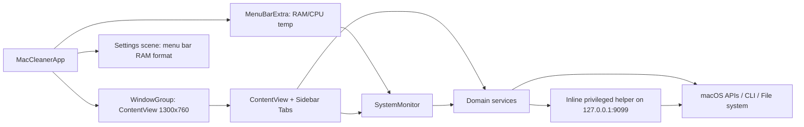
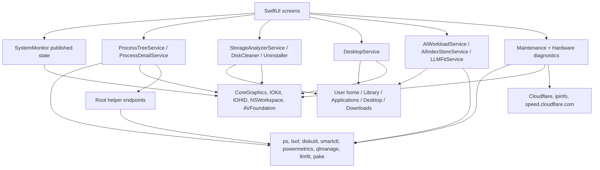
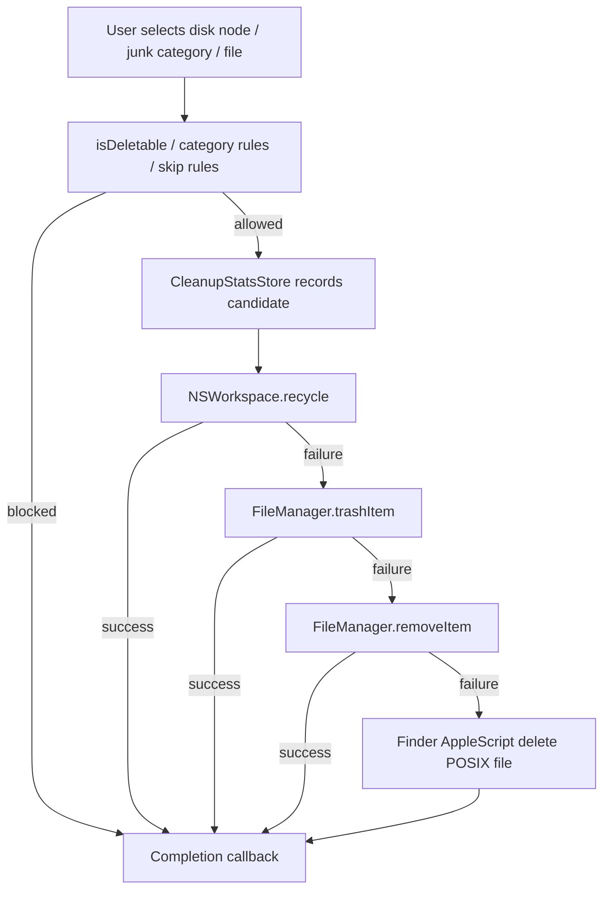
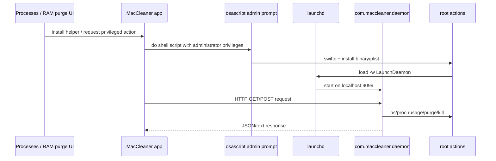
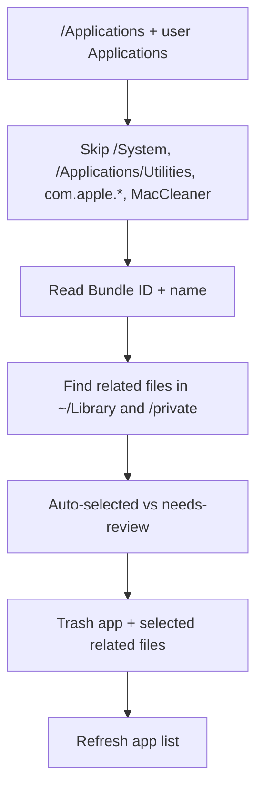

# MacCleaner: технический baseline текущей версии

Дата фиксации: 2026-07-09  
Репозиторий: `/Users/dmitriy/Docs/project/MacCleaner`  
Git: `main`, commit `f629358`, рабочее дерево чистое на момент анализа  
Версия приложения: `CFBundleShortVersionString=1.0`, `CFBundleVersion=1`  
Bundle ID: `com.maccleaner.app`  
macOS target: `13.0+`  
Swift: `5.0`

## 1. Назначение документа

Этот документ фиксирует фактическую работу текущей версии MacCleaner до обновления агента/модели. Его назначение - быть контрольной технической версией для последующего сравнения: какие разделы существуют, какие сервисы вызываются, какие директории macOS исследуются, какие методы удаления применяются, какие лимиты глубины/времени стоят в коде, где используются повышенные права, сеть, AppleScript и внешние CLI.

Под "текущей версией" ниже понимается состояние Xcode target `MacCleaner`, а не только наличие файлов в репозитории. Это важно: в репозитории есть файлы `MacCleaner/Helper/HelperManager.swift` и `MacCleaner/Helper/MacCleanerDaemon.swift`, но в активный target они не включены. Эффективная реализация privileged helper находится inline в `MacCleaner/Services/SystemMonitor.swift`.

## 2. Источники анализа

| Область | Источник |
|---|---|
| Target и build settings | `MacCleaner.xcodeproj/project.pbxproj` |
| App entry point, меню, settings scene | `MacCleaner/MacCleanerApp.swift` |
| Главная навигация и встроенные storage views | `MacCleaner/Views/ContentView.swift` |
| Мониторинг системы и inline root helper | `MacCleaner/Services/SystemMonitor.swift` |
| Процессы, окна, kill-потоки | `MacCleaner/Services/ProcessTreeService.swift`, `ProcessDetailService.swift`, `ProcessDetailView.swift`, `ProcessesView.swift` |
| Очистка, RAM, DNS, refresh, shredder | `MacCleaner/Services/CleanerService.swift`, `MacCleaner/Views/CleanerView.swift` |
| Storage, junk, disk map, cleanup stats | `MacCleaner/Services/StorageAnalyzerService.swift`, `MacCleaner/Views/StorageView.swift` |
| Uninstaller | `MacCleaner/Services/UninstallerService.swift` |
| Desktop manager | `MacCleaner/Services/DesktopService.swift`, `DesktopManagerView.swift` |
| AI agents / MCP / skills | `MacCleaner/Services/AIWorkloadService.swift`, `AIWorkloadViews.swift` |
| AI index stores | `MacCleaner/Services/AIIndexStoreService.swift` |
| LLM fit library | `MacCleaner/Services/LLMFitService.swift`, `LLMFitModels.swift` |
| Pake web apps | `MacCleaner/Views/WebAppsView.swift` |
| SMC, fans, thermals | `MacCleaner/Services/SMCService.swift`, `FansView.swift` |
| Maintenance / diagnostics | `MaintenanceService.swift`, `MaintenanceView.swift`, `HardwareDiagnosticServices.swift`, `KeyboardDiagnosticService.swift`, `ToolDiagnosticsView.swift` |
| Entitlements / plist / release | `MacCleaner/Info.plist`, `MacCleaner/MacCleaner.entitlements`, `scripts/build_dmg.sh` |

## 3. Сборка, права и упаковка

| Параметр | Текущее значение | Комментарий |
|---|---:|---|
| Sandbox | `com.apple.security.app-sandbox=false` | Приложение не sandboxed, поэтому файловый доступ зависит от macOS permissions, Full Disk Access, владельца файлов и прав процесса. |
| Apple Events | `com.apple.security.automation.apple-events=true` | Нужно для Finder/AppleScript сценариев, включая Trash fallback и Desktop icon positions. |
| User-selected RW | `com.apple.security.files.user-selected.read-write=true` | Разрешает доступ к выбранным пользователем файлам. |
| Unsigned executable memory | `com.apple.security.cs.allow-unsigned-executable-memory=true` | Расширенное entitlement-право; в baseline важно отслеживать, останется ли оно после обновления. |
| Hardened runtime Debug | `NO` | Debug-сборка менее ограничена. |
| Hardened runtime Release | `YES` | Release включает hardened runtime. |
| Release signing script | `CODE_SIGNING_ALLOWED=NO`, затем ad-hoc `codesign --force --deep --sign -` | DMG для локального распространения, не Developer ID/notarized. |
| Notarization | Нет | README прямо указывает, что публичное распространение должно использовать Developer ID и notarization. |
| NSAppleEventsUsageDescription | "MacCleaner needs access to Finder to move protected files to the Trash." | Техническая причина - Finder/AppleScript fallback для удаления. |

## 4. Общая архитектура

Комментарий: `SystemMonitor` является общим `@StateObject` для основного окна и menu bar. Основные функциональные разделы не являются независимыми процессами: это SwiftUI views, которые вызывают сервисы в том же приложении. Исключение - privileged helper, который компилируется и устанавливается отдельно по запросу.

## 5. Разделы приложения

| Раздел UI | enum/tab | Основной view | Основные сервисы | Что делает |
|---|---|---|---|---|
| Dashboard | `.dashboard` | `OverviewView` | `SystemMonitor` | Сводка памяти, CPU, дисков, процессов, температуры, батареи, сети/GPU через published state. |
| About | `.about` | `AboutView` | `SystemMonitor` | Информация об устройстве/железе; доступна через нижний hardware block, не как обычный пункт sidebar. |
| Processes | `.processes` | `ProcessesView` | `ProcessTreeService`, `ProcessDetailService`, `HelperManager` | Список процессов, дерево/плоский список, окна, memory/CPU, детали процесса, kill, установка helper. |
| Fans | `.fans` | `FansView` | `SMCService`, `SystemMonitor` | Температуры, вентиляторы, fan target/manual/auto на Intel при доступности AppleSMC. |
| Optimize | `.cleaner` | `CleanerView` | `RAMCleaner`, `DiskCleaner`, `DNSCleaner`, `SystemRefreshService`, `Shredder UI` | RAM purge, disk junk cleanup, DNS flush, refresh tasks, deletion of selected shredder files. |
| Windows | `.windows` | `WindowsView` | `SystemMonitor`, `ProcessTreeService.fetchWindows` | Окна из CoreGraphics window list, привязка к процессам. |
| Disk | `.disk` | `DiskDetailView` | `SystemMonitor` | Диски/volumes из mounted volume URLs и resource values. |
| Storage | `.storage` | `StorageView` | `StorageAnalyzerService`, `UninstallerService`, `CleanupStatsStore` | Uninstaller, Disk Map, Large Files, Junk Files, cleanup intelligence. |
| Desktop | `.desktop` | `DesktopManagerView` | `DesktopService` | Визуальный менеджер Desktop/current folder, позиции иконок, организация, rename/move/trash. |
| Pake Apps | `.webApps` | `WebAppsView` | `PakePackager` | Упаковка websites в standalone apps через внешний `pake` CLI. |
| Agents | `.aiAgents` | `AIWorkloadViews` | `AIWorkloadService` | Анализ AI agent processes, MCP configs, skills, components. |
| Indexes | `.aiIndexes` | `AILoadView` | `AIIndexStoreService` | В enum есть, но в sidebar напрямую не выводится; анализ LanceDB/index stores. |
| Library | `.aiLibrary` | `AILibraryView` | `LLMFitService` | Каталог моделей через внешний `llmfit` CLI. |
| Tools | `.maintenance` | `MaintenanceView`, `ToolDiagnosticsView`, `KeyboardDiagnosticView` | `MaintenanceService`, `HardwareDiagnosticServices`, `KeyboardDiagnosticService` | Screen dim, keyboard lock, speaker/keyboard/pointer/storage/SMART/thermal/network diagnostics. |
| Settings | macOS Settings scene | `SettingsView` | `SettingsManager` | Настройка формата RAM в menu bar: percent или value. |

## 6. Runtime cadence и фоновые обновления

`SystemMonitor` запускает периодический refresh примерно каждые 15 секунд. Не все данные обновляются на каждом тике.

| Данные | Метод / источник | Каденс |
|---|---|---:|
| Memory | `host_statistics64` | Каждый refresh |
| CPU | `host_processor_info` | Каждый refresh |
| Network | `getifaddrs` | Каждый refresh |
| Mounted disks | `FileManager.mountedVolumeURLs` + resource values | Каждый refresh |
| Sensors/fans/thermal | `SMCService` / HID thermal | Каждый 4-й тик, примерно 60 секунд |
| Processes | `ProcessTreeService.fetchFlatProcesses` | Каждый 7-й тик, примерно 105 секунд, либо forced |
| Battery | IOKit power sources / IORegistry | Каждый 20-й тик, примерно 5 минут |
| External Bluetooth battery | `system_profiler` | Каждый 120-й тик, примерно 30 минут |
| GPU | IORegistry `IOAccelerator` | В тяжелом background snapshot |

Комментарий: thermal history ограничен 120 точками. При фактической выборке раз в 60 секунд это около 2 часов данных, хотя комментарий в коде говорит про 6 минут.

## 7. Карта данных и потоков

Комментарий: приложение сочетает три типа доступа: системные API, shell/CLI и прямой файловый обход. Это надо сравнивать отдельно при будущей версии: изменение одного слоя не обязательно меняет другие.

## 8. Полная карта исследования директорий

| Область | Корень/директории | Глубина и лимиты | Что собирается | Действия |
|---|---|---|---|---|
| Disk Map / Large Files | Фактически `~` и отдельно `~/Library`; параметр `scan(url:)` игнорируется и не меняет корень | `maxEntries=30000`, `maxDuration=12s`; рекурсия только пока `depth < 3`; package descendants skipped; hidden files skipped | `FSNode`, top 80 children, `largeFiles > 10 MB`, top 150 | Можно delete/trash только для `node.isDeletable` |
| Junk Files | `~/Library/Caches`, `~/Library/Developer/Xcode/DerivedData`, `~/Library/Logs`, `~/.Trash`, `~/Downloads` | `scanPath` обходит root; hidden skipped; для Downloads собираются individual files | Категории userCache, xcodeJunk, userLogs, trash, downloads | Category cleanup через `removeItem`; Downloads по файлам |
| Junk enum, но не реализовано в scan | `systemCache`, `systemLogs`, `browserCache`, `unusedDMG`, `screenCaptures` | Нет фактического обхода в `scanJunk()` | В UI/enum присутствуют | На текущем коде не заполняются отдельным scan |
| DiskCleaner static targets | Browser caches, developer caches, AI tool caches, app caches, misc caches, logs, Saved Application State, Trash | Размер директории: `maxEntries=20000`, `maxDuration=1.5s`, skips packages | `DiskJunkItem` с category/risk/default selection | Cleanup удаляет содержимое выбранных директорий или выбранный файл через `removeItem` |
| DiskCleaner dynamic app caches | `~/Library/Caches/*`, `~/Library/Application Support/*/(CachedData|GPUCache|Cache|Code Cache|...)`, Chrome profiles | Threshold `>512 KB` | Dynamic cache entries | То же |
| Cursor agent old versions | `~/.local/share/cursor-agent/versions` | Сортировка имен версий, newest сохраняется | Старые версии Cursor Agent | Selected by default как cleanable |
| VSCode/Cursor extensions | `~/.vscode/extensions`, `~/.cursor/extensions` | Extensions `>5 MB` | Obsolete/large extension candidates | `isSelected=false` |
| Uninstaller app roots | `/Applications`, user applicationDirectory | Non-recursive app bundle enumeration, hidden/package descendants skipped | `.app` bundles с Bundle ID | Root app и selected leftovers move to Trash |
| Uninstaller related user Library | `~/Library/Containers`, `Application Support`, `Caches`, `HTTPStorages`, `Preferences`, `ByHost`, `Saved Application State`, `Application Scripts`, `sharedfilelist`, `CrashReporter`, `Logs`, `LaunchAgents`, `Group Containers`, `WebKit` | По bundle id/name patterns | Related files auto-selected или needs-review | `FileManager.trashItem` |
| Uninstaller volatile/system receipts | `/private/var/folders/*/*/C`, `/private/var/folders/*/*/T`, `/private/var/db/receipts` | Pattern by bundle id | Marked needs-review, not selected by default | Trash if user selects |
| Desktop summary | `~/Desktop` | Recursive enumerator, skips hidden/package descendants | Counts by categories, files only | Summary only |
| Desktop current folder | Desktop или выбранная папка | One-level `contentsOfDirectory`, skips hidden | Files and directories, Finder positions, metadata | Trash, move, rename, duplicate, auto-organize |
| AI Codex | `~/.codex`, `~/.codex/skills`, `~/.codex/plugins/cache`, config/auth | Skills recursively find `SKILL.md`; cache TTL 10s for components/source | Components, MCP config, skills | Read-only analysis |
| AI Hermes | `~/.hermes`, `/Applications/Hermes.app`, `~/hermes-desktop/...`, LaunchAgents, App Support | Path existence + skill roots | Components, MCP, skills | Read-only analysis |
| AI Antigravity | `~/.antigravity*`, `~/.gemini/antigravity*`, `/Applications/Antigravity*.app`, Desktop copy, App Support | Path existence, config JSON paths, extension/rule roots | Components, MCP, skills | Read-only analysis |
| AI Devin/Windsurf | `~/.devin`, `~/.config/devin`, `~/.windsurf`, App Support, local share/cache | Path existence + extension/skills | Components, MCP, skills | Read-only analysis |
| AI Claude Code | `~/.claude`, `~/Library/Application Support/Claude/claude_desktop_config.json` | Skill/plugin manifest search | Components, MCP, skills | Read-only analysis |
| AI Cursor | `~/.cursor`, `~/.cursor/skills-cursor`, app support/caches, `/Applications/Cursor.app` | Path existence + workspace rules | Components, MCP, skills | Read-only analysis |
| AI index stores | LanceDB default app dir, workspace `.lancedb`, `.lance`, `data/lancedb`, `~/.lancedb`, `~/.lance`, `~/Library/Application Support/LanceDB` | Directory size max 2000 items; package cache TTL 120s | LanceDB components, packages, running processes | Read-only analysis |
| AI package search | `~/.local`, `~/.pyenv`, `~/Library/Python`, `~/.npm`, `~/.nvm`, `~/node_modules`, `/opt/homebrew/lib`, `/usr/local/lib` | `maxDepth=6`, `maxMatches=12` | Installed lancedb/@lancedb packages | Read-only analysis |
| Pake Apps output | `~/Applications/Pake Apps` | One-level installed app list; recursive find after build | `.app` bundles generated by Pake | Open, move to Trash |
| Diagnostics | Boot volume `/`, `/dev/disk0`, network endpoints | Command-specific timeouts | Disk/SMART/power/network snapshots | Read-only commands except admin reads; persistence in UserDefaults |

## 9. StorageAnalyzer: логика удаления и safety funnel

Комментарий: для single node/file trash path есть несколько fallback-ступеней. Важный факт baseline: если Trash не сработал, код может перейти к прямому `removeItem`, то есть к hard delete, а затем к Finder AppleScript. Это не просто "move to Trash".

### 9.1 Правила deletable path

| Правило | Текущее поведение |
|---|---|
| Safe prefixes проверяются первыми | Если путь начинается с safe prefix, он считается допустимым раньше, чем locked prefixes. |
| Safe prefixes | `~/Library/Caches`, `~/Library/Logs`, Xcode/dev caches, Steam, Chrome, Telegram, Spotify, `~/Downloads`, `~/Desktop`, `~/Documents`, media folders, `~/.Trash`, `~/Docs`, `~/go`, `~/PycharmProjects`, `~/skillz-macos` и ряд пользовательских project dirs. |
| Locked prefixes | `/System`, `/usr`, `/bin`, `/sbin`, `/private/var`, `/private/etc`, `/Library`, `/Applications`, `~/Library/Containers`, `~/Library/Group Containers`, `~/Library/Application Support`, `~/Library/Preferences`, `~/Library/Keychains`, `~/Library`. |
| Default home rule | Если путь не попал в locked и находится внутри home, он может считаться deletable. |
| Packages | Disk map пропускает package descendants; bundle может выглядеть как leaf. |
| Permission denied | В junk cleanup permission denied ошибки пропускаются, не превращая весь cleanup в fatal. |

### 9.2 Junk category selection defaults

| Категория | Selected by default | Фактически сканируется сейчас |
|---|---:|---:|
| userCache | Да | Да |
| systemCache | Да | Нет |
| xcodeJunk | Нет | Да |
| systemLogs | Да | Нет |
| browserCache | Да | Нет |
| userLogs | Да | Да |
| unusedDMG | Да | Нет |
| trash | Да | Да |
| downloads | Нет | Да |
| screenCaptures | Да | Нет |

### 9.3 Junk skip rules

| Категория | Исключения |
|---|---|
| user/system cache | Пропускаются имена/пути с `com.apple.homekit`, `cloudkit`, `containermanagerd`, `security`, `tcc`, `trustd`, `akd`, `identityservicesd`; также Apple containers/group containers. |
| xcodeJunk | Не удаляются `Archives` и `DeviceSupport`. |
| Any | Permission denied для отдельного child не останавливает всю очистку. |

## 10. DiskCleaner / Optimize

`CleanerView` имеет два режима: professional и optimization. В optimization cleanup одновременно запускает RAM purge, DNS flush, system refresh и disk cleanup выбранных items после confirmation alert.

| Компонент | Сканирование | Удаление / действие | Риски/ограничения |
|---|---|---|---|
| RAMCleaner | Анализ inactive/compressed memory, top memory processes, wired kernel memory | `/usr/sbin/purge` только через установленный helper; выбранные top processes могут завершаться | Compressed/top processes по умолчанию review/not selected; helper обязателен для purge |
| DiskCleaner | Static + dynamic directories, threshold/timeout limits | `FileManager.removeItem` для contents выбранных directories или file | Это не Trash. Root dir обычно сохраняется, contents удаляются. |
| DNSCleaner | Readiness only | `dscacheutil -flushcache`; затем `kill -HUP mDNSResponder` через bash | Success если хотя бы одна команда ок |
| SystemRefreshService | Discover maintenance tasks | CLI и direct file removals по задачам | Часть задач удаляет plist/db-wal/db-shm/zero-size files |
| Shredder UI | User selects files only; directories disabled | Фактически `FileManager.removeItem` по каждому файлу | UI обещает secure overwrite/random bytes, но текущая реализация не перезаписывает данные |

### 10.1 DiskCleaner static families

| Family | Примеры путей |
|---|---|
| Browser caches | Chrome, Safari, Firefox, Edge, Arc, Brave, Puppeteer cache roots |
| Developer caches | Xcode DerivedData/CoreSimulator/Caches/Archives, VS Code workspaceStorage, npm/yarn/pip/gradle/corepack/docker buildx |
| AI tools | `~/.gemini/... Cache/Code Cache/GPUCache/tmp`, `~/.claude`, `~/.continue`, `~/.aider/cache` |
| App caches | Spotify, Music, Podcasts, Slack, VSCode, Figma |
| Misc | Steam, Ghostty, appcache/logs/depotcache |
| User logs | `~/Library/Logs/Xcode`, DiagnosticReports, CoreSimulator, CrashReporter |
| State | `~/Library/Saved Application State` |
| Trash | `~/.Trash` |

### 10.2 System refresh tasks

| Task | Текущее действие |
|---|---|
| QuickLook cache | `qlmanage -r cache` |
| QuickLook thumbs/reset | `qlmanage -r` |
| Saved window state | Удаление contents `~/Library/Saved Application State` |
| Quarantine DB | Удаление `~/Library/Preferences/com.apple.LaunchServices.QuarantineEventsV2` |
| Font cache | `atsutil databases -remove` |
| Launch Services | `lsregister -r -domain local -domain user` с fallback через find |
| Shared file list | Удаление zero-size файлов в `~/Library/Application Support/com.apple.sharedfilelist` |
| Broken LaunchAgents | Удаление plist, если Program/ProgramArguments executable отсутствует |
| Notification DB temporary files | Удаление `.db-wal` / `.db-shm` в GroupContainers с notificationcenterui |
| Orphaned Spotlight exclusions | Удаление non-existent paths из Spotlight exclusions plist |
| Login items | Удаление corrupted `~/Library/LaunchAgents/*.plist` |
| DS_Store network/USB policy | `defaults write DSDontWriteNetworkStores/USBStores` |
| Knowledge usage DB temp | Удаление `.db-wal` / `.db-shm` |
| Corrupted prefs | Удаление corrupted `~/Library/Preferences/*.plist` |
| Purge memory | Not selected by default |

## 11. Privileged helper

| Параметр | Текущее поведение |
|---|---|
| Реальная реализация | Inline Swift source string внутри `SystemMonitor.swift`, компилируется при установке. |
| Binary path | `/Library/PrivilegedHelperTools/com.maccleaner.daemon` |
| LaunchDaemon plist | `/Library/LaunchDaemons/com.maccleaner.daemon.plist` |
| Install method | `/usr/bin/swiftc` + copy/chown/chmod + `launchctl load -w` через `osascript do shell script ... with administrator privileges` |
| Listen address | `127.0.0.1:9099` |
| Auth | Нет токена/подписи/handshake; доверие основано на localhost и macOS user boundary |
| Status check | `GET http://127.0.0.1:9099/processes` |

### 11.1 Helper endpoints

| Endpoint | Метод | Действие |
|---|---|---|
| `/processes` | GET | Возвращает процессы: `ps -axo pid`, затем `proc_pid_rusage(RUSAGE_INFO_V4)` для footprint и disk read/write. |
| `/purge` | POST | Запускает `/usr/sbin/purge`. |
| `/kill?pid=N` | POST | SIGTERM, затем SIGKILL, если процесс не protected. |

### 11.2 Helper protected process names

`kernel_task`, `launchd`, `windowserver`, `logd`, `mds`, `coreaudiod`, `configd`, `opendirectoryd`, `diskarbitrationd`, а также префиксы `com.apple.security`, `com.apple.system`, `com.apple.kernel`.

Комментарий: в приложении есть еще собственный список protected процессов в `ProcessTreeService`; списки не полностью идентичны.

## 12. Processes и Process Detail

| Функция | Метод |
|---|---|
| Flat process list | `/bin/ps -wwwwaxo pid=,ppid=,pcpu=,rss=,time=,args=` с `LC_ALL=C`, timeout 3s |
| Helper enhancement | Если helper установлен, HTTP `/processes` добавляет footprint и disk I/O |
| Window mapping | `CGWindowListCopyWindowInfo([.optionOnScreenOnly, .excludeDesktopElements])` |
| Display name | Из `.app` path или executable name |
| Protected process rule | PID <= 1, текущий PID, protected names, protected prefixes |
| Kill without helper | `Darwin.kill(SIGTERM)`, затем `SIGKILL` |
| Kill with helper | POST `/kill?pid=N` |
| Detail commands | `ps`, `lsof`, `pgrep`, `grep/head/cut/awk` через `/bin/sh -c`, timeout 3s |
| Reveal/copy | Finder reveal и copy summary |
| Detail kill buttons | В `ProcessDetailView` прямой `Darwin.kill(SIGTERM/SIGKILL)` после protected-check |

Protected names в app включают системные процессы macOS и сам `MacCleaner`. Это снижает риск случайного завершения критичных процессов, но не является kernel-level защитой.

## 13. Uninstaller

| Правило | Текущее поведение |
|---|---|
| App roots | `/Applications` и пользовательская applicationsDirectory |
| Exclusions | `/System`, `/Applications/Utilities`, bundle id `com.apple.*`, MacCleaner itself |
| Auto-selected leftovers | Containers, Application Support by bundle id, Caches, HTTPStorages, Preferences/ByHost, Saved Application State, Application Scripts, sharedfilelist, CrashReporter, Logs, LaunchAgents, Group Containers, WebKit |
| Needs-review leftovers | Application Support by app name, `/private/var/folders/*/*/C|T`, `/private/var/db/receipts` |
| Size calculation | App bundle uses bounded folder traversal; related directory sizes may be resource-value based and can undercount |
| Root-owned app | Если `isDeletableFile` false, root app пропускается с логом; privileged uninstall не реализован |
| Delete method | `FileManager.trashItem` for app and selected leftovers |

## 14. Desktop Manager

| Функция | Метод |
|---|---|
| Desktop summary | Recursive enumeration of `~/Desktop`, skips hidden/package descendants, counts files by category |
| Current folder scan | One-level `contentsOfDirectory`, directories included with size 0 |
| File categories | Extension mapping plus screenshot heuristics: `screenshot`, `screen shot`, `снимок экрана`, `capture` |
| Icon positions | xattr `com.apple.FinderInfo`; batch AppleScript load; AppleScript set position |
| Wallpaper | `NSWorkspace.shared.desktopImageURL` |
| Trash | `FileManager.trashItem` |
| Auto-organize | Moves files into Desktop subfolders by category |
| Metadata | Image EXIF/TIFF/GPS through `CGImageSource` |
| File operations | Rename, move, duplicate, open, reveal in Finder |

Комментарий: Desktop manager является файловым менеджером для Desktop/current folder, а не только визуализацией. Он реально перемещает/переименовывает/удаляет файлы.

## 15. AI agent workload

`AIWorkloadService` классифицирует процессы на `system`, `userApp`, `agent`, `modelRuntime`, `vectorIndex`, `orchestration`, `buildTool`. Профили строятся, если найдены anchor paths или процессы.

| Agent/profile | Проверяемые источники |
|---|---|
| Codex | `~/.codex`, `~/.codex/skills`, `~/.codex/plugins/cache`, `~/.codex/config.toml`, `~/.codex/auth.json` |
| Hermes | `~/.hermes`, `~/.hermes/skills`, `/Applications/Hermes.app`, `~/hermes-desktop/...`, `~/Library/LaunchAgents/ai.hermes.gateway.plist`, App Support |
| Antigravity | `~/.antigravity*`, `~/.gemini/antigravity*`, `/Applications/Antigravity*.app`, `~/Desktop/Antigravity.app`, App Support, settings JSON |
| Devin/Windsurf | `~/.devin`, `~/.config/devin`, `~/.windsurf`, `~/Library/Application Support/Devin`, local share/cache |
| Claude Code | `~/.claude`, `~/.claude/skills`, `~/.claude/plugins`, Claude desktop MCP config |
| Cursor | `~/.cursor`, `~/.cursor/skills-cursor`, App Support/Caches Cursor, `/Applications/Cursor.app` |
| Aider / Goose / Continue | Process/name heuristics and known config/cache locations |

### 15.1 MCP and skills parsing

| Область | Метод |
|---|---|
| Codex MCP | Ad hoc parsing of `~/.codex/config.toml` sections `[mcp_servers.name]` |
| Claude/Cursor/Devin/Antigravity MCP | JSON/config path checks and lightweight parsing |
| YAML/TOML | Не полноценный parser; используются строковые/регулярные эвристики |
| Skills | Recursively find `SKILL.md` under skill roots; Claude plugins additionally `plugin.json` / `PLUGIN.md` |
| Workspace rules | `FileManager.default.currentDirectoryPath`, e.g. `.cursorrules`, `.cursor/rules`, `.antigravity` |
| Cache | Components/source TTL около 10 секунд |

Комментарий: AI workload section является инспектором среды агента. Он не устанавливает и не удаляет skills/MCP, но читает конфигурации и директории.

## 16. AI index stores

| Параметр | Текущее поведение |
|---|---|
| Поддерживаемый backend | Только LanceDB |
| Process detection | Names/command lines containing `lancedb`, ` lance `, `/lance`, `.lance` |
| App default dir | `~/Library/Application Support/MacCleaner/AI/Indexes/lancedb` |
| Workspace candidates | `.lancedb`, `.lance`, `data/lancedb` |
| Home candidates | `~/.lancedb`, `~/.lance`, `~/Library/Application Support/LanceDB` |
| Dependency detection | `package.json`, lock files, `requirements`, `pyproject`, `uv.lock`, `Cargo.toml` containing lancedb/lance |
| Installed package search | `~/.local`, `~/.pyenv`, `~/Library/Python`, `~/.npm`, `~/.nvm`, `~/node_modules`, `/opt/homebrew/lib`, `/usr/local/lib` |
| Limits | Package search `maxDepth=6`, `maxMatches=12`; directory size max 2000 items |
| Cache | Snapshot cache TTL 10s, package cache TTL 120s |
| Known stale path | Hardcoded fallback `/Users/dmitriy/Docs/project/new`; в текущей среде этот path не существует |

## 17. LLM Library через llmfit

| Функция | Команда |
|---|---|
| Compatible models | `llmfit fit --json --sort <sort> -n <limit>` плюс `--perfect` и/или `--tool-use` |
| All models | `llmfit list --json --sort <sort>` |
| Model info | `llmfit info <modelName> --json` |
| Timeout | 30s |
| Cache | list/fit TTL 60s |
| Environment | `/usr/bin/env llmfit`, PATH=`/usr/local/bin:/opt/homebrew/bin:/usr/bin:/bin:/usr/sbin:/sbin`, `LC_ALL=C` |
| Temp files | stdout/stderr пишутся во временные `MacCleaner-llmfit-*.json/.err`, затем удаляются |

Комментарий: без установленного `llmfit` раздел Library не может отдать данные. Это внешняя runtime-зависимость, не встроенная в app bundle.

## 18. Pake Apps

| Параметр | Текущее поведение |
|---|---|
| Presets | ChatGPT, Gemini, Claude, Claude Code, Perplexity, Discord, YouTube, GitHub, Figma, Notion, Linear, Slack |
| Custom URL | Нормализуется: если нет scheme, добавляется `https://`; host должен содержать `.` |
| App name | Sanitized alphanumerics/spaces/`-_`, title-cased words |
| Output directory | `~/Applications/Pake Apps` |
| Build command | `/usr/bin/env pake <url> --name <appName>` |
| Timeout | 300s |
| Environment | `PAKE_CREATE_APP=1`; PATH добавляет `~/Library/pnpm`, `~/.npm-global/bin`, Homebrew/system paths |
| Retry | При ряде npm/install/network условий retry с `PAKE_USE_CN_MIRROR=1` |
| Registry | `UserDefaults` key `pakeWebAppsRegistry` |
| Installed list | One-level `.app` bundles in output directory |
| Delete | Terminate/forceTerminate matching running app, затем `FileManager.trashItem` |

Комментарий: Pake запускается как внешний CLI из PATH. Приложение не верифицирует бинарь `pake` по подписи или known path.

## 19. SMC, fans, thermals, battery, GPU

| Область | Метод | Ограничение |
|---|---|---|
| Intel SMC | AppleSMC IOService keys | Может читать fan/temperature и менять fan target/manual/auto при доступности |
| Apple Silicon fans | AppleSMC keys недоступны | Возвращаются placeholders/ограниченные данные по модели |
| Apple Silicon thermals | Private IOHIDEventSystemClient symbols via `dlopen` | Private API риск; если недоступно, возвращается empty |
| powermetrics fallback в SMC | Не используется | Комментарий в коде: требует sudo и может блокировать UI |
| Battery | IOKit power sources + IORegistry AppleSmartBattery | Read-only |
| External Bluetooth battery | `system_profiler` | Запускается редко, примерно раз в 30 минут |
| GPU | IORegistry `IOAccelerator` | Heuristic read |

## 20. Maintenance и diagnostics

### 20.1 Screen dim / keyboard lock

| Параметр | Текущее поведение |
|---|---|
| Durations | 60s, 300s, 900s, 1800s, manual |
| Opacity | full 1.0, partial 0.9, manual effective 1.0 |
| Countdown | 3s перед screen dim |
| Overlay | Borderless `NSWindow` на built-in screen heuristic, `screenSaver` level, black alpha, label `=)` |
| Exit | Esc, Cmd+Q, mouse click |
| Keyboard lock | `CGEventTap` blocks keyDown/keyUp/flagsChanged/systemDefined; Cmd+Q exits |
| Fallback shortcuts | Carbon hotkey + NSEvent global/local monitors |
| Quit suppression | App intercepts Cmd+Q/terminate around maintenance exit |

### 20.2 Hardware diagnostics

| Diagnostic | Метод | Права/сеть |
|---|---|---|
| Speaker test | `AVAudioEngine`, modes left/stereo/right/sweep/rattle/pinkNoise/impulse | Local audio output |
| Keyboard diagnostic | Event logging, key codes, modifiers/repeats | Local UI events |
| Pointer input | UI state persisted in UserDefaults | Local UI events |
| Storage health | `diskutil info -plist /`, timeout 3s | Read-only |
| Disk integrity | `diskutil verifyVolume /`, timeout 25s | Read-only live volume verify |
| Advanced SSD | `smartctl -a /dev/disk0`, timeout 45s | Admin via osascript; requires smartmontools |
| Thermal/power | `powermetrics --samplers cpu_power,gpu_power,thermal -i 1000 -n 3`, timeout 45s | Admin via osascript |
| Network | Cloudflare trace, ipinfo, Cloudflare speed endpoints | External network |

## 21. Внешние команды и сетевые вызовы

| Команда/endpoint | Где используется | Назначение |
|---|---|---|
| `/bin/ps` | Process list, helper, details | Список процессов, PID/PPID/CPU/RSS/time/args |
| `/usr/sbin/purge` | Helper RAM purge | Очистка inactive memory |
| `/bin/kill` / Darwin kill | Process termination, DNS mDNSResponder | SIGTERM/SIGKILL/HUP |
| `/usr/sbin/dscacheutil -flushcache` | DNS cleaner | Flush DNS cache |
| `/bin/bash -c "kill -HUP $(pgrep mDNSResponder)..."` | DNS cleaner | Restart/HUP mDNSResponder |
| `lsof` | Process detail | Open files, listening ports |
| `pgrep`, `grep`, `head`, `cut`, `awk` | Process detail | Parent/children/details |
| `system_profiler` | External battery | Bluetooth battery snapshot |
| `qlmanage` | System refresh | QuickLook cache/reset |
| `atsutil` | System refresh | Font cache |
| `lsregister` | System refresh | LaunchServices rebuild |
| `defaults` | System refresh | DS_Store policy |
| `diskutil info -plist /` | Storage health | Boot volume info/SMART fields |
| `diskutil verifyVolume /` | Disk integrity | APFS volume verify |
| `smartctl -a /dev/disk0` | Advanced SSD | Deep SMART |
| `powermetrics` | Thermal power | CPU/GPU/thermal sample |
| `osascript` | Helper install, admin diagnostics, Finder fallback | Admin prompt / AppleScript |
| `llmfit` | AI Library | Model catalog/fit |
| `pake` | Pake Apps | Build web app wrapper |
| Cloudflare trace | Network diagnostic | Edge/IP/routing info |
| `ipinfo.io/json` | Network diagnostic | Public IP/geo/provider info |
| `speed.cloudflare.com` | Network diagnostic | HTTP latency/download/upload |

## 22. Persistence и локальные state-файлы

| Данные | Location/key | Формат |
|---|---|---|
| Cleanup stats | `~/Library/Application Support/MacCleaner/cleanup-stats.json` | JSON, maxEntries 800, maxEvents 600 |
| Menu bar RAM format | `UserDefaults`, `menuBarRAMFormat` | AppStorage enum |
| Pake web app registry | `UserDefaults`, `pakeWebAppsRegistry` | JSON-encoded dictionary |
| Speaker test snapshot | `UserDefaults`, `MacCleaner.Diagnostics.SpeakerTest.lastSnapshot` | JSON |
| Storage health snapshot | `UserDefaults`, `MacCleaner.Diagnostics.StorageHealth.lastSnapshot` | JSON |
| Disk integrity snapshot | `UserDefaults`, `MacCleaner.Diagnostics.DiskIntegrity.lastSnapshot` | JSON |
| Advanced SSD snapshot | `UserDefaults`, `MacCleaner.Diagnostics.AdvancedSSD.lastSnapshot` | JSON |
| Thermal/power snapshot | `UserDefaults`, `MacCleaner.Diagnostics.ThermalPower.lastSnapshot` | JSON |
| Network snapshot | `UserDefaults`, `MacCleaner.Diagnostics.Network.lastSnapshot` | JSON |
| Keyboard diagnostic state | `UserDefaults`, `MacCleaner.Diagnostics.Keyboard.lastState` | JSON |
| Pointer diagnostic state | `UserDefaults`, `MacCleaner.Diagnostics.PointerInput.lastState` | JSON |
| LLMFit temp output | `FileManager.default.temporaryDirectory/MacCleaner-llmfit-*` | Temp JSON/err, removed after command |
| Pake generated apps | `~/Applications/Pake Apps/*.app` | App bundles |
| Helper binary/plist | `/Library/PrivilegedHelperTools/com.maccleaner.daemon`, `/Library/LaunchDaemons/com.maccleaner.daemon.plist` | Root-installed files |

## 23. CleanupStatsStore

| Параметр | Текущее поведение |
|---|---|
| Actor | `MainActor` singleton |
| Stable vs rebuildable | Rebuildable markers include Xcode DerivedData/index/modulecache, CoreSimulator caches, `.build`, SwiftPM, `node_modules/.cache`, V8/GPU/Code Cache, shader caches |
| De-duplication | 30-day bytes de-duped by path |
| Max entries | 800 |
| Max events | 600 |
| Recording | Called by StorageAnalyzer, DiskCleaner, Uninstaller cleanup paths |

## 24. Безопасность: текущие гарантии и исключения

### 24.1 Что защищено

| Защита | Где |
|---|---|
| Protected process lists | `ProcessTreeService`, inline helper |
| Confirmation dialogs | Process kill, Pake delete, Cleaner optimization cleanup, other destructive UI flows |
| Not-selected-by-default risky categories | Xcode junk/downloads in Junk; compressed/top process RAM sources; VSCode/Cursor extensions |
| Trash-first for some flows | Uninstaller, Desktop, Pake delete, StorageAnalyzer trash path starts with recycle/trash |
| Timeout limits | Process commands, `llmfit`, `pake`, disk size scans, diagnostics |
| Skip hidden/package descendants | Several file enumerations |
| Admin prompt instead of password capture | Helper install, smartctl, powermetrics use `osascript ... with administrator privileges`; RAM purge requires helper |

### 24.2 Что не защищено полностью

| Риск | Фактическое состояние |
|---|---|
| Root helper auth | Localhost HTTP service has no token, nonce, code signature check, or per-request authorization. |
| Hard delete fallback | StorageAnalyzer trash path can fall back to `FileManager.removeItem`. |
| DiskCleaner deletion | Uses `removeItem`, not Trash. |
| Shredder claim mismatch | UI says secure overwrite, implementation only deletes selected files. |
| External CLI trust | `pake` and `llmfit` are resolved from PATH; no signature/path pinning. |
| Private APIs | IOHID thermal reading uses private symbols. |
| Sandbox disabled | Broad local access possible if macOS permissions allow it. |
| Full Disk Access variability | Without Full Disk Access some scans undercount or skip protected folders. |
| Incomplete UI categories | Some Junk categories exist in enum/UI but have no current scan implementation. |
| Stale workspace path | AI index service contains fallback `/Users/dmitriy/Docs/project/new`, which is absent in this environment. |

## 25. Known discrepancies to compare after update

| ID | Текущее состояние | Почему важно |
|---|---|---|
| D-001 | `StorageAnalyzerService.scan(url:)` ignores passed URL and scans home + Library. | Если новая версия начнет уважать URL, результаты Disk Map резко изменятся. |
| D-002 | Junk enum содержит больше категорий, чем реально сканирует `scanJunk()`. | UI/метрики могут выглядеть богаче фактической очистки. |
| D-003 | Shredder не перезаписывает данные, несмотря на secure wording в UI. | Безопасность удаления завышена в интерфейсе. |
| D-004 | Root helper compiled from inline source; files в `MacCleaner/Helper/` не активны в target. | Риск неверного аудита helper при сравнении по файлам. |
| D-005 | Helper HTTP on `127.0.0.1:9099` без auth. | Критичная security regression/improvement точка. |
| D-006 | Disk map depth ограничена примерно 3 уровнями и 12 сек. | "Размеры директорий" не являются полным `du` всего диска. |
| D-007 | DiskCleaner `dirSize` ограничен 20k entries/1.5s. | Большие папки могут быть оценены приблизительно. |
| D-008 | Uninstaller related directory size может undercount. | UI size estimates для leftovers могут быть неполными. |
| D-009 | Release script ad-hoc signs DMG app and не notarizes. | Distribution/security posture baseline. |
| D-010 | `llmfit`/`pake` являются внешними runtime dependencies. | Новая версия может встроить или заменить CLI. |

## 26. Target membership notes

| Файл/группа | Статус |
|---|---|
| `MacCleaner/Services/*.swift` | Основные сервисы включены в target. |
| `MacCleaner/Views/*.swift` | Views включены в target, включая small stub files для Storage subviews. |
| `MacCleaner/Settings/*.swift` | Settings включены и используются через `Settings { SettingsView() }`. |
| `MacCleaner/Models/*.swift` | Data models включены в target. |
| `MacCleaner/Helper/*.swift` | Файлы существуют, но не перечислены в PBXBuildFile/PBX sources. Не являются effective code текущего app target. |
| `MacCleaner/Views/UninstallerView.swift`, `DiskAnalyzerView.swift`, `LargeFilesView.swift` | Включены, но фактические большие implementations этих views находятся внутри `ContentView.swift`; эти файлы являются tiny compatibility/stub files. |

## 27. Сравнительная контрольная матрица для будущей версии

При обновлении агента/модели новую версию стоит сравнивать минимум по этим пунктам:

| Блок | Что сравнить |
|---|---|
| Build/security | Sandbox, hardened runtime, entitlements, signing/notarization, bundle id/version |
| Navigation | Список tabs, скрытые tabs, доступность Settings/About/Indexes |
| Directory scopes | Все root paths, depth, timeouts, max entries, hidden/package behavior |
| Deletion | Trash vs hard delete, fallback порядок, confirmation dialogs, default selections |
| Helper | Install path, endpoint list, auth, port, protected process list, launchd behavior |
| Process safety | Protected names/prefixes, kill path через helper/direct, detail kill behavior |
| Junk implementation | Соответствие enum/UI фактическому scan |
| Shredder | Есть ли overwrite/secure erase реально, а не только UI text |
| AI agent analysis | Список агентов, config paths, parser type, workspace rule roots |
| AI index analysis | Supported backends, stale hardcoded paths, dependency search roots |
| External CLIs | `llmfit`, `pake`, `smartctl`, `powermetrics`, command timeouts, PATH |
| Network | Endpoint list, cache/no-cache behavior, privacy impact |
| Persistence | UserDefaults keys, App Support files, helper install leftovers |
| Diagnostics | Admin prompts, read-only vs mutating commands, stored snapshots |

## 28. Итоговая техническая характеристика текущей версии

MacCleaner текущей версии - нативное SwiftUI macOS-приложение без sandbox, с широким набором локальных инспекторов и очистителей. Оно сочетает read-only мониторинг через macOS APIs, shell-команды с timeout, прямой обход пользовательских директорий и несколько реально destructive paths. Наиболее глубокие файловые обходы ограничены по времени, количеству entries и глубине; это сделано для интерактивности UI, но означает, что результаты не являются полным forensic-сканом диска.

Самые важные baseline-факты для будущего сравнения:

1. Disk Map фактически сканирует home + Library, а не произвольный переданный root.
2. Junk UI шире фактической реализации scan.
3. DiskCleaner и часть refresh tasks используют прямой `removeItem`.
4. StorageAnalyzer может перейти от Trash к hard delete fallback.
5. Root helper слушает localhost:9099 без application-level authentication.
6. Shredder не выполняет secure overwrite.
7. AI workload анализирует большое количество agent/config/skill путей read-only, но парсит TOML/YAML/JSON в основном эвристически.
8. `llmfit` и `pake` не встроены, а запускаются как внешние CLI из PATH.
9. Release packaging является локальным/ad-hoc, не notarized.
10. Effective helper code находится inline в `SystemMonitor.swift`, а не в `MacCleaner/Helper/*.swift`.
