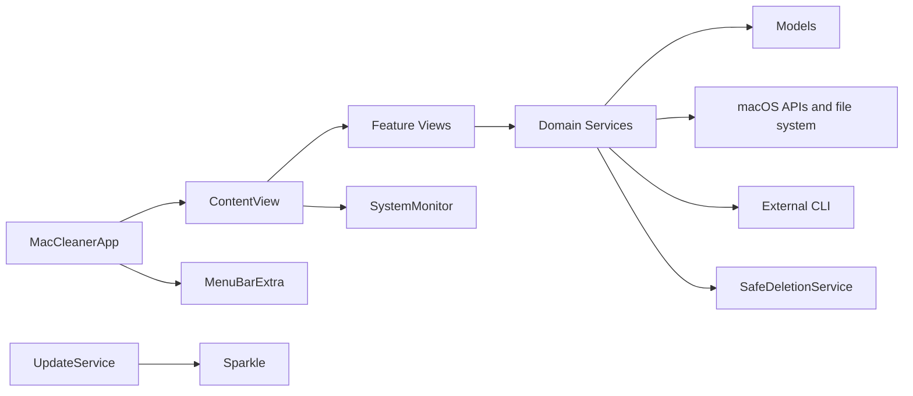

# Architecture

## Обзор

MacCleaner — монолитное нативное macOS-приложение на SwiftUI. UI, доменные сервисы и модели собираются в один app target; отдельный test target проверяет safety- и policy-контракты. Основное разделение проходит по каталогам `Views`, `Services`, `Models` и `Settings`.



## Точки входа

- `MacCleaner/MacCleanerApp.swift` содержит `@main MacCleanerApp`.
- Главное окно имеет фиксированный content size 1300×760 и открывает `ContentView`.
- `MenuBarExtra` показывает компактный мониторинг через общий `SystemMonitor`.
- `Settings` открывает `SettingsView` и управляет форматом RAM в menu bar.
- `AppDelegate` сохраняет приложение после закрытия последнего окна и корректно завершает активные maintenance-режимы.
- Sparkle-команда проверки обновлений добавлена в меню приложения.

## Навигация и состояние

`MacCleaner/Views/ContentView.swift` владеет корневой навигацией `Tab` и долгоживущими сервисами функций.

Основные вкладки: Dashboard, About, Processes, Fans, Optimize, Windows, Disk, Storage, Desktop, Pake Apps, Agents, Indexes, Library и Utilities. В sidebar напрямую показывается подмножество; About доступен через нижний hardware block, а Indexes входит в AI-область.

Корневые `@StateObject`:

- `UninstallerService`
- `StorageAnalyzerService`
- `StorageWorkspaceService`
- `DesktopService`
- `CleanerViewState`
- `PakePackager`
- `UpdateService.shared`
- `AppModalCoordinator`

Storage предварительно создаётся один раз и сохраняется в стабильной hierarchy. При переключении вкладки состояние завершённой операции сбрасывается, но активная операция не прерывается неявно.

## Общая телеметрия

`MacCleaner/Services/SystemMonitor.swift` публикует память, CPU, диски, процессы, окна, вентиляторы, температуры, батарею, сеть и GPU. Cadence зависит от активных consumers: специализированные экраны получают более свежие данные, а idle-режим уменьшает число тяжёлых snapshot и `system_profiler` запусков.

Источники данных включают Mach APIs, IOKit, IORegistry, CoreGraphics, `getifaddrs`, mounted volume resource values и ограниченные shell-команды.

## Доменные сервисы

### Storage

- `StorageAnalyzerService.swift` — Disk Map, Large Files, Junk, cleanup history и статистика.
- `StorageWorkspaceService.swift` — общий lifecycle Advisor, Duplicates, Similar Photos и Cloud Reclaim.
- `CleanupAdvisorService.swift` — ранжированные рекомендации по размеру, риску и стоимости восстановления.
- `DuplicateFinderService.swift` — metadata grouping, quick fingerprint и полный SHA-256.
- `SimilarPhotoService.swift` — локальные ImageIO/Vision fingerprints.
- `CloudReclaimService.swift` — проверка ubiquitous metadata и локальный eviction.
- `UninstallerService.swift` — приложения и связанные пользовательские файлы.
- `ScanResourceBudget.swift` — общие entry/deadline limits.

### Optimize и процессы

- `CleanerService.swift` — анализ RAM, disk junk, DNS и system refresh.
- `StartupOptimizerService.swift` — LaunchAgents, reversible disable/restore и runtime impact.
- `ProcessTreeService.swift` — process snapshot, агрегация экземпляров, SIGTERM/SIGKILL по явному действию.
- `ProcessDetailService.swift` — подробности выбранного процесса.
- `SafeDeletionService.swift` — единая path policy и Trash-only удаление.

### Прочие области

- `DesktopService.swift` — Desktop/current folder, сортировка, перемещение, rename, preview и Trash.
- `AIWorkloadService.swift` — процессы AI-инструментов, профили агентов, MCP и skills.
- `AIIndexStoreService.swift` — локальные AI/index stores.
- `LLMFitService.swift` — библиотека и оценка моделей через `llmfit`.
- `SMCService.swift` — SMC/fan/thermal данные с hardware-dependent fallback.
- `MaintenanceService.swift` — screen dim, keyboard lock и объединённый режим.
- `HardwareDiagnosticServices.swift` — speaker, storage health, APFS, SSD, thermal power и network.
- `KeyboardDiagnosticService.swift` — события клавиатуры и диагностическая сессия.
- `UpdateService.swift` — адаптер состояния поверх Sparkle.

## UI-инфраструктура

`MacCleaner/Views/DesignSystem.swift` содержит semantic colors, typography, графики, button styles, `AppSegmentedControl`, footer и общий `AppModalOverlay`. `AppModalCoordinator` централизует информационные и feature overlays.

## Безопасность

`SafeDeletionService` нормализует путь, проверяет границы директорий, защищает app и рабочие данные MacCleaner и вызывает `FileManager.trashItem`. Permanent-delete fallback в мигрированных пользовательских flows отсутствует.

Legacy root daemon сохранён в `SystemMonitor.swift` только внутри `#if false`; текущий `HelperManager` умеет обнаружить и удалить старую установку, но не устанавливает и не вызывает daemon.

Приложение не sandboxed. Entitlements разрешают Apple Events, user-selected read/write и отключение library validation для runtime-зависимостей.

## Обновления и зависимости

- Sparkle `2.9.4` подключён через SwiftPM.
- Appcast передаётся по HTTPS и подписывается EdDSA.
- Автоматическая проверка настроена на 6 часов.
- `MacCleaner/ReleaseNotes.md` является единым источником текста для окна Updates, GitHub Release и appcast.
- Внешние `pake`, `llmfit`, `smartctl` и `powermetrics` доступны только при наличии в системе и соответствующих прав.

## Тесты

`MacCleanerTests/SafetyPolicyTests.swift` содержит 39 XCTest-тестов. Они проверяют path boundaries, защиту данных MacCleaner, Trash semantics, scan budgets, cleanup ranking, exact duplicates, similar photos, cloud reclaim, startup items, process aggregation, RAM policy, reset-контракты и глубокий Large Files scan.

Проверка 2026-07-13:

```text
xcodebuild test -project MacCleaner.xcodeproj -scheme MacCleaner \
  -destination 'platform=macOS' CODE_SIGNING_ALLOWED=NO
TEST SUCCEEDED
```

## Связанные материалы

- [[Product]]
- [[Features]]
- [[Decisions]]
- [[Backlog]]
