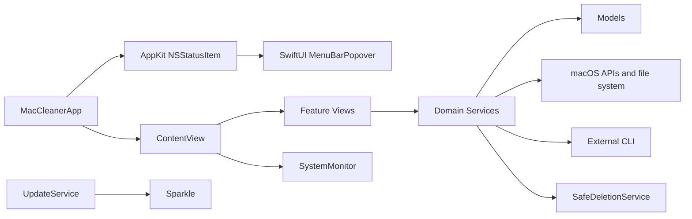

# Architecture

## Обзор

MacCleaner — монолитное нативное macOS-приложение на SwiftUI. UI, доменные сервисы и модели собираются в один app target; отдельный test target проверяет safety- и policy-контракты. Основное разделение проходит по каталогам `Views`, `Services`, `Models` и `Settings`.

Репозиторий также содержит независимый статический промо-сайт в `website/`. Он не входит в app target, не имеет runtime-зависимостей и использует HTML, CSS и небольшой vanilla JavaScript. Первый экран состоит из двух последовательно анимируемых физических состояний MacBook с общей геометрией и точкой шарнира: фронтальная внешняя крышка с защитным знаком сначала полностью складывается в тонкую линию, после чего без временного наложения проявляется корпус с ограниченной по перспективе клавиатурной декой и раскрывающимся назад display lid. После раскрытия виден macOS desktop с menu bar, Dock и обычным окном MacCleaner.

Интерактив не воспроизводит интерфейс HTML-компонентами, а по порядку переключает 11 системных снимков основных sidebar-разделов: Dashboard, Processes, Fans / Cooling, Disk, Optimize, Storage, Desktop, Pake Apps, Agents, Library и Tools. Системные захваты окна нормализованы до `2600 × 1576`, не содержат указателя мыши и отображаются без изменения пропорций. Внешние стрелки, горизонтальный tablist и прозрачные hotspot-кнопки над реальной боковой панелью используют один контроллер переключения. Нижняя продуктовая часть не дублирует gallery: отдельные композиции раскрывают системный обзор, AI Agents и maintenance/diagnostics, а остальные направления представлены текстовой feature band.



## Точки входа

- `MacCleaner/MacCleanerApp.swift` содержит `@main MacCleanerApp`.
- Главное окно имеет фиксированный content size 1300×760 и открывает `ContentView`.
- AppKit `NSStatusItem` показывает компактный мониторинг через общий `SystemMonitor`, а его popover остаётся SwiftUI-представлением.
- `Settings` открывает `SettingsView` и управляет составом, drag-порядком, стилем и форматом модулей menu bar.
- Первая вкладка Settings также показывает статическую companion-карточку Browser Monitor: локальный asset, ссылки на репозиторий и ZIP релиза и popover-инструкцию установки. MacCleaner не загружает и не устанавливает расширение самостоятельно.
- `AppDelegate` сохраняет приложение после закрытия последнего окна и корректно завершает активные maintenance-режимы.
- Sparkle-команда проверки обновлений добавлена в меню приложения.

## Навигация и состояние

`MacCleaner/Views/ContentView.swift` владеет корневой навигацией `Tab` и долгоживущими сервисами функций.

Основные вкладки: Dashboard, About, Processes, Fans, Optimize, Startup, Windows, Disk, Storage, Desktop, Pake Apps, Agents, Indexes, Library и Utilities. В sidebar напрямую показывается подмножество; About доступен через нижний hardware block, а Indexes входит в AI-область.

Корневые `@StateObject`:

- `UninstallerService`
- `StorageAnalyzerService`
- `StorageWorkspaceService`
- `DesktopService`
- `CleanerViewState`
- `PakePackager`
- `UpdateService.shared`
- `AppModalCoordinator`

Storage предварительно создаётся один раз и сохраняется в стабильной hierarchy. При переключении вкладки состояние завершённой операции сбрасывается, но активная операция не прерывается неявно.

## Общая телеметрия

`MacCleaner/Services/SystemMonitor.swift` публикует память, CPU, диски, процессы, окна, вентиляторы, температуры, батарею, сеть и GPU. Cadence зависит от активных consumers: специализированные экраны получают более свежие данные, а idle-режим уменьшает число тяжёлых snapshot и `system_profiler` запусков.

Источники данных включают Mach APIs, IOKit, IORegistry, CoreGraphics, `getifaddrs`, mounted volume resource values и ограниченные shell-команды.

### Диагностический журнал

`DiagnosticLogStore` — локальный журнал событий жизненного цикла и периодических performance samples. Он хранит записи в `~/Library/Application Support/MacCleaner/diagnostic-logs.json`, ограничивает срок хранения (7/30/90 дней) и общий объём, а в Settings → Other позволяет очистить журнал или экспортировать его в JSON/CSV. Записи содержат только агрегированные метрики и технические сообщения: содержимое файлов, секреты и сетевой трафик не записываются. `ThermalLoadAlertService` отслеживает устойчивые CPU/thermal-пороги и передаёт rich alert в отдельную nonactivating AppKit-панель `ThermalLoadAlertPanelController`: она находится над другими окнами в правом верхнем углу, показывает top-3 процессов и не встраивается в MacCleaner UI. При inactive/background scene тяжёлые collectors приостанавливаются, оставляя lightweight alert sampling.

## Доменные сервисы

### Storage

- `StorageAnalyzerService.swift` — Disk Map, Large Files, Junk, cleanup history и статистика.
- `StorageWorkspaceService.swift` — общий lifecycle Advisor, Duplicates, Similar Photos и Cloud Reclaim.
- `CleanupAdvisorService.swift` — ранжированные рекомендации по размеру, риску и стоимости восстановления.
- `DuplicateFinderService.swift` — metadata grouping, quick fingerprint и полный SHA-256.
- `SimilarPhotoService.swift` — локальные ImageIO/Vision fingerprints.
- `CloudReclaimService.swift` — проверка ubiquitous metadata и локальный eviction.
- `UninstallerService.swift` — приложения и связанные пользовательские файлы.
- `ScanResourceBudget.swift` — общие entry/deadline limits.

### Optimize и процессы

- `CleanerService.swift` — единый Opt-сценарий с анализом RAM, disk junk, DNS и system refresh; дисковые roots выбираются пользователем, а уже проверенные roots повторно не обходятся в рамках сессии.
- `CleanerView` разделяет Opt на два layout-состояния: ready/scanning/cleaning/success используют компактный круг действия, а review — полноразмерный отчёт со строками категорий, путей и чекбоксами. В review круг скрывается, чтобы список не перекрывался; смена фаз сопровождается spring/opacity-анимацией.
- Root picker использует две явные колонки с фиксированным порядком областей, а review rows сортируются детерминированно по размеру и пути. Это сохраняет стабильную визуальную геометрию между повторными сканированиями.
- Scan scope хранит локальное состояние раскрытия и по умолчанию не занимает место в ready-панели; раскрытие выполняется через центральный disclosure control. Storage `JunkFilesView` использует параллельную структуру review: summary metrics, expandable category entries и явные footer actions.
- `CleanerView` получает явный `onOpenStartup` callback от `ContentView`; компактная Startup-ссылка только меняет корневую вкладку на `.startup`, оставляя `StartupOptimizerService` и его lifecycle в отдельном разделе.
- `SidebarView` не показывает `.startup`; этот tab остаётся внутренней корневой целью навигации и открывается через `CleanerView`.
- Review footer Optimize и Storage построены одинаково: Cancel/Done управляют выходом из review, а Clean остаётся отдельным подтверждаемым destructive action и отключается без выбранных элементов.
- Optimize review deliberately uses neutral surfaces and typography for summary information; the scope disclosure uses opacity-only animation and compact row metrics to avoid competing with the central action circle.
- `StartupOptimizerService.swift` — отдельный раздел Startup: LaunchAgents, reversible disable/restore и runtime impact.
- `ProcessTreeService.swift` — process snapshot, агрегация экземпляров, SIGTERM/SIGKILL по явному действию.
- `ProcessDetailService.swift` — подробности выбранного процесса.
- `SafeDeletionService.swift` — единая path policy и Trash-only удаление.

### Прочие области

- `DesktopService.swift` — Desktop/current folder, сортировка, перемещение, rename, preview и Trash.
- `AIWorkloadService.swift` — процессы AI-инструментов, профили агентов, MCP и skills.
- `CodexUsageService` (в `AIWorkloadService.swift`) — read-only запрос к локальному Codex app-server `account/rateLimits/read`; кэширует результат на минуту и не трогает auth/config.
- `AIIndexStoreService.swift` — локальные AI/index stores.
- `LLMFitService.swift` — библиотека и оценка моделей через `llmfit`.
- `SMCService.swift` — SMC/fan/thermal данные с hardware-dependent fallback.
- `MaintenanceService.swift` — screen dim, keyboard lock и объединённый режим.
- `HardwareDiagnosticServices.swift` — speaker, storage health, APFS, SSD, thermal power и network.
- `KeyboardDiagnosticService.swift` — события клавиатуры и диагностическая сессия.
- `UpdateService.swift` — адаптер состояния поверх Sparkle.
- `DiagnosticLogStore.swift` — retention, очистка и экспорт локальных диагностических записей.
- `ThermalLoadAlertService.swift` — sustained CPU/thermal thresholds and alert payloads.
- `ThermalLoadAlertPanelController.swift` — отдельная nonactivating panel для внешнего rich alert и перехода в Processes.

### Drop Shelf

`ShelfStore` принимает file URL из drag-and-drop или Clipboard, сразу делает копию файла в закрытом временном каталоге текущей сессии и больше не использует исходный URL как источник для последующих операций. При каждом drag-out `NSItemProvider` создаётся заново из стандартного URL-file provider Apple и указывает только на disposable export-копию; это покрывает Finder и приложения вроде Telegram. Для destinations без поддержки drag `copyForPaste` помещает отдельный export в системный pasteboard для Cmd+V. Session-копия никогда не публикуется наружу. Поэтому приложение-получатель может переместить экспорт в свою корзину или чат, не перемещая и не повреждая исходник пользователя или копию в Shelf. Временные текстовые и графические элементы остаются session-only.
- `ThermalAlertPreferences` — локальные настройки включения предупреждений и порогов CPU/температуры, редактируемые в Settings → Notifications.
- `FileReaderToolView` — BETA-инструмент локального чтения PDF, изображений, текста и бинарных hex-preview без загрузки или изменения исходного файла.

## UI-инфраструктура

`MacCleaner/Views/DesignSystem.swift` содержит semantic colors, typography, графики, button styles, `AppSegmentedControl`, footer и общий `AppModalOverlay`. `AppModalCoordinator` централизует информационные и feature overlays.

### Модульные Tools и menu bar

`UtilityToolID` является единым каталогом инструментов. `SettingsManager` сохраняет выбранный пользователем набор Tools, быстрые menu bar actions, состав, drag-порядок, индивидуальный формат и индивидуальный стиль `Battery / Values` каждого telemetry gauge. Настройка Tools содержит один переключатель присутствия для готового инструмента; File Reader, Media Compressor, App Audio Report и Charge Limit видимы как `BETA / In development`, но не могут попасть в рабочий sidebar до готовности. Быстрый доступ настраивается отдельно во вкладке Menu Bar. `UtilityToolsView` строит постоянную левую source-list навигацию только из включённых готовых инструментов; первый пункт всегда открывает вводный экран с локальной SwiftUI-анимацией, учитывающей Reduce Motion. Floating Drop Shelf в Tools содержит только настройки панели и shortcuts; drop target доступен в отдельном floating окне. Detail-экраны Physical Maintenance и Speaker Test используют компактные отступы без лишнего вертикального скролла, а системные tooltip-информации не открывают модальное окно.

Системная логика новых инструментов вынесена в `UtilityToolServices.swift` и `ClipboardHistoryService.swift`. Floating Shelf и Clipboard History принадлежат самостоятельным nonactivating `NSPanel`, поэтому `⌥S` и `⌥C` показывают только нужную utility-панель, не открывая и не поднимая главное окно. Hotkeys регистрируются при запуске процесса, а не при появлении SwiftUI-сцены; они продолжают работать, пока MacCleaner запущен в menu bar или фоне. Узкий `NSViewRepresentable` меняет уровень Shelf между `.floating` и `.normal`; закрепление хранится локально и по умолчанию включено. Carbon использует физические key codes, поэтому команды не зависят от английской/русской раскладки и не требуют глобального чтения клавиатуры.

Команды Shelf в Tools представлены общим `SubtleToolIconButton`: нейтральная icon-only поверхность усиливается только при hover, а название действия сохранено в tooltip и accessibility label. Empty state floating panel использует три коротких ярлыка — Drop in, Drag out и Safe copy — вместо длинной инструкции; заполненные строки дополнительно показывают Drag out. Действия верхних Shelf/Clipboard-карточек находятся непосредственно после их заголовков и используют компактный размер. Парная высота определяется через SwiftUI preference как максимум естественных высот обеих карточек, поэтому они совпадают без жёсткой константы и адаптируются к шрифту и содержимому. Pin toggle использует `MutedSwitchStyle`: компактную нейтральную capsule без зависимости от яркого system accent color.

`ClipboardHistoryService` опрашивает только `NSPasteboard.changeCount`, хранит до 12 уникальных session-only элементов и поддерживает текст, изображения и file URLs. Для каждой записи `PasteboardPayload` материализует все доступные representations исходных pasteboard items и восстанавливает их вместе: plain text, RTF/HTML, image types, file URLs и дополнительные форматы источника не сводятся к одному preview-типу. Тот же payload создаёт `NSItemProvider` для добавления текущего clipboard в Shelf, поэтому последующий drag-out сохраняет набор форматов. Компактный borderless `NSPanel` использует системный `NSVisualEffectView` с material `.popover` и blending `.behindWindow`, поэтому фон остаётся бесцветным, полупрозрачным и адаптивным к теме macOS. Видимых action-кнопок нет: при открытии выделяется самая свежая запись, стрелки меняют выделение и прокручивают список, Enter восстанавливает выбранное, отправляет `⌘V` в приложение, активное до открытия панели, двойной клик делает то же мышью, очистка доступна из контекстного меню, а `⌘1–4` возвращает первые четыре элемента в pasteboard. Панель закрывается при клике вне или после восстановления; данные не записываются на диск.

Menu bar использует существующий `SystemMonitor`, поэтому включение CPU/RAM/GPU/temperature/battery gauges не создаёт параллельный sampler. `StatusBarController` владеет AppKit `NSStatusItem`; каждый модуль независимо выбирает `Battery` или `Values`. `Battery` показывает подписанный вертикальный indicator: заполнение снизу вверх передаёт нагрузку/нагрев, semantic green/orange/red — severity, temperature сохраняет термометр, а compact marker (`%/C`, `%/G`, `%/°`, `C/F`, `%/clock`) обозначает формат и использует тот же semantic color. `Values` выводит рядом с `CPU`, `RAM`, `GPU`, `TEMP`, `BAT` фактическое процентное или числовое значение. Точные values остаются в accessibility label, tooltip и SwiftUI `MenuBarPopover`. Settings хранит состав, порядок, формат и стиль каждого gauge; прежний общий style автоматически мигрирует во все индивидуальные записи. В UI глобального блока `Display style` нет: обе пары настроек находятся в строке модуля как icon-only segmented controls с tooltip и accessibility label. Включённые строки являются draggable tiles, а выключенные остаются ниже как неактивные плитки. Когда все gauges выключены, status item показывает bundle icon MacCleaner.

Обычный клик по `NSStatusItem` показывает transient popover без `NSApp.activate`, поэтому существующее главное окно не поднимается поверх текущего приложения. Пока popover видим, `StatusBarController` держит временный global mouse monitor: внешний клик закрывает меню, а monitor удаляется через `NSPopoverDelegate` сразу после закрытия. Активация сохраняется только у явных действий `Open MacCleaner` и `Settings…`.

Визуально каждый menu bar gauge собран в центрированную группу: short label + vertical battery + marker либо short label + monospaced direct value. Группы разделены тонкими semantic dividers. Для AppKit image attachments задаётся явный baseline offset, чтобы 16-point battery не поднимала и не опускала соседний текст. Temperature добавляет термометр только в battery-композиции; числовой режим уже содержит единицу измерения. Settings preview использует тот же выбранный стиль.

Media Compressor, App Audio Report и Charge Limit временно исключены из runtime-каталога и обозначены beta только в Settings. Их код не считается доступной пользовательской функцией до отдельного возвращения. Screen Text и Awake Profiles также отсутствуют в runtime-каталоге.

## Безопасность

`SafeDeletionService` нормализует путь, проверяет границы директорий, защищает app и рабочие данные MacCleaner и вызывает `FileManager.trashItem`. Permanent-delete fallback в мигрированных пользовательских flows отсутствует.

Legacy root daemon source удалён; текущий `HelperManager` умеет обнаружить и удалить старую установку, но не устанавливает и не вызывает daemon.

Приложение не sandboxed. Entitlements разрешают Apple Events, user-selected read/write и отключение library validation для runtime-зависимостей.

### Owner-группировка Junk Files

`StorageAnalyzerService` сохраняет developer- и AI-данные внутри существующего `Junk Files`, но выдаёт их отдельными стабильными owner-группами. Группы включают Xcode (DerivedData, Archives, Device Support, Simulator data/runtime), SwiftPM, CocoaPods, Carthage, Homebrew, npm/Yarn/pnpm, Python pip/uv, Gradle/Maven, Cargo, Go, JetBrains, VS Code/Cursor/Claude caches и обнаруженные артефакты проектов.

Каждая группа содержит объяснение, размер, тип последствий (`rebuild`, `redownload`, `review`, `protected`) и, для проектных артефактов, путь проекта. Для Git-проектов выполняется локальный `git status --porcelain`; незакоммиченные изменения не блокируют сам анализ, но требуют отдельного подтверждения перед Trash. AI-модели, Hugging Face storage и Docker Desktop data отмечены как protected и не удаляются массовым действием.

В результатах сканирования группа раскрывается в плоское дерево `категория → элементы`. Для каждого элемента показываются имя, полный путь и размер. Если корень содержит больше 12 дочерних элементов, оставшиеся мелкие файлы объединяются в одну строку-папку с количеством элементов и суммарным размером. Категории с последствиями `safe`, `rebuild` или `redownload` автоматически отмечаются для очистки; `review` и `protected` остаются снятыми.

Открытые поддерживаемые браузеры обнаруживаются через `NSWorkspace`. Перед очисткой браузерных кэшей приложение просит подтверждение и отправляет обычный terminate-запрос; принудительное завершение не используется. Все реальные удаления по-прежнему проходят через `SafeDeletionService` и Trash.

Large Files сначала использует обычный пользовательский `FileManager.trashItem`. Если конкретные выбранные файлы отклонены macOS по правам доступа, пользователь может отдельно подтвердить системный запрос администратора; повторная операция адресно перемещает только эти файлы в текущую пользовательскую корзину через `/usr/bin/osascript`. Пароль не передаётся приложению и не сохраняется.

## Обновления и зависимости

- Sparkle `2.9.4` подключён через SwiftPM.
- Appcast передаётся по HTTPS и подписывается EdDSA.
- Автоматическая проверка настроена на 6 часов и полностью принадлежит планировщику Sparkle; `ContentView` не запускает дополнительные фоновые сессии при появлении окна.
- Пользовательская команда вызывает foreground `checkForUpdates()`, поэтому стандартный Sparkle user driver показывает Download → Install → Relaunch и поднимает уже найденное или скачанное обновление. Automatic mode разрешает только периодический поиск; фоновая загрузка отключена, а Download → Install → Relaunch остаётся явным действием пользователя.
- `MacCleaner/ReleaseNotes.md` является единым источником текста для окна Updates, GitHub Release и appcast.
- Внешние `pake`, `llmfit`, `smartctl` и `powermetrics` доступны только при наличии в системе и соответствующих прав.
- Промо-сайт не требует сборщика или JavaScript-фреймворка и может публиковаться как обычный набор статических файлов из `website/`.

## Тесты

`MacCleanerTests/SafetyPolicyTests.swift` содержит 53 XCTest-теста. Они проверяют path boundaries, защиту данных MacCleaner, Trash semantics и исчезновение временного файла между сканированием и очисткой, scan budgets, cleanup ranking, exact duplicates, similar photos, cloud reclaim, startup items, process aggregation, RAM policy, reset-контракты, глубокий Large Files scan, Opt root selection/cache, запрет сохранения увеличившегося результата Media Compressor, исключение beta-инструментов из workspace, компактные форматы, два стиля menu bar gauges, сохранение выбранного стиля и drag-порядка, а также полный pasteboard representation round-trip.

Проверка 2026-07-18:

```text
xcodebuild test -project MacCleaner.xcodeproj -scheme MacCleaner \
  -destination 'platform=macOS' CODE_SIGNING_ALLOWED=NO
TEST SUCCEEDED
```

## Связанные материалы

- [[Product]]
- [[Features]]
- [[Decisions]]
- [[Opportunities]]
