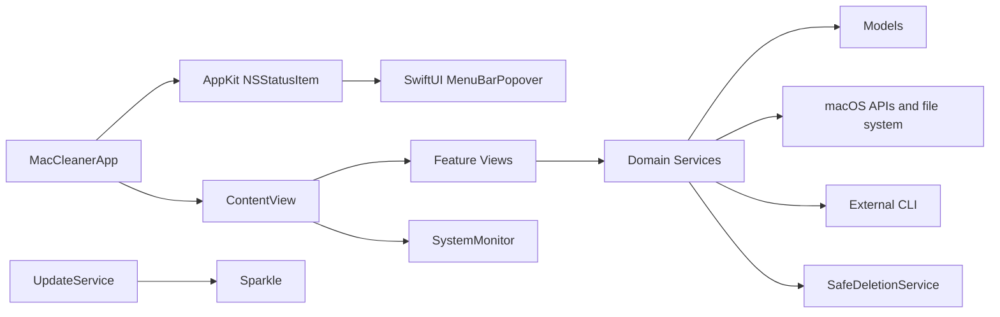

# Architecture

## Обзор

MacCleaner — монолитное нативное macOS-приложение на SwiftUI. UI, доменные сервисы и модели собираются в один app target; отдельный test target проверяет safety- и policy-контракты. Основное разделение проходит по каталогам `Views`, `Services`, `Models` и `Settings`.

Репозиторий также содержит независимый статический промо-сайт в `website/`. Он не входит в app target, не имеет runtime-зависимостей и использует HTML, CSS и небольшой vanilla JavaScript. Первый экран состоит из двух последовательно анимируемых физических состояний MacBook с общей геометрией и точкой шарнира: фронтальная внешняя крышка с защитным знаком сначала полностью складывается в тонкую линию, после чего без временного наложения проявляется корпус с ограниченной по перспективе клавиатурной декой и раскрывающимся назад display lid. После раскрытия виден macOS desktop с menu bar, Dock и обычным окном MacCleaner.

Интерактив не воспроизводит интерфейс HTML-компонентами, а по порядку переключает 11 системных снимков основных sidebar-разделов: Dashboard, Processes, Fans / Cooling, Disk, Optimize, Storage, Desktop, Pake Apps, Agents, Library и Tools. Системные захваты окна нормализованы до `2600 × 1576`, не содержат указателя мыши и отображаются без изменения пропорций. Внешние стрелки, горизонтальный tablist и прозрачные hotspot-кнопки над реальной боковой панелью используют один контроллер переключения. Нижняя продуктовая часть не дублирует gallery: отдельные композиции раскрывают системный обзор, AI Agents и maintenance/diagnostics, а остальные направления представлены текстовой feature band.


```mermaid
flowchart LR
    App[MacCleanerApp] --> Root[ContentView]
    App --> Menu[AppKit NSStatusItem]
    Menu --> Popover[SwiftUI MenuBarPopover]
    Root --> Views[Feature Views]
    Root --> Monitor[SystemMonitor]
    Views --> Services[Domain Services]
    Services --> Models[Models]
    Services --> OS[macOS APIs and file system]
    Services --> CLI[External CLI]
    Services --> Safety[SafeDeletionService]
    Update[UpdateService] --> Sparkle[Sparkle]
```

## Точки входа

- `MacCleaner/MacCleanerApp.swift` содержит `@main MacCleanerApp`.
- Главное окно имеет фиксированный content size 1300×760 и открывает `ContentView`.
- AppKit `NSStatusItem` показывает компактный мониторинг через общий `SystemMonitor`, а его popover остаётся SwiftUI-представлением.
- `Settings` открывает `SettingsView` и управляет составом, drag-порядком, стилем и форматом модулей menu bar.
- Первая вкладка Settings также показывает статическую companion-карточку Browser Monitor: локальный asset, ссылки на репозиторий и ZIP релиза и popover-инструкцию установки. MacCleaner не загружает и не устанавливает расширение самостоятельно.
- `AppDelegate` сохраняет приложение после закрытия последнего окна и корректно завершает активные maintenance-режимы.
- Sparkle-команда проверки обновлений добавлена в меню приложения.

## Навигация и состояние

`MacCleaner/Views/ContentView.swift` владеет корневой навигацией `Tab` и долгоживущими сервисами функций.

Основные вкладки: Dashboard, About, Processes, Fans, Optimize, Startup, Windows, Disk, Storage, Desktop, Pake Apps, Agents, Indexes, Library и Utilities. В sidebar напрямую показывается подмножество; About доступен через нижний hardware block, а Indexes входит в AI-область.

Корневые `@StateObject`:

- `UninstallerService`
- `StorageAnalyzerService`
- `StorageWorkspaceService`
- `DesktopService`
- `CleanerViewState`
- `PakePackager`
- `UpdateService.shared`
- `AppModalCoordinator`

Storage предварительно создаётся один раз и сохраняется в стабильной hierarchy. При переключении вкладки состояние завершённой операции сбрасывается, но активная операция не прерывается неявно.

## Общая телеметрия

`MacCleaner/Services/SystemMonitor.swift` публикует память, CPU, диски, процессы, окна, вентиляторы, температуры, батарею, сеть и GPU. Cadence зависит от активных consumers: специализированные экраны получают более свежие данные, а idle-режим уменьшает число тяжёлых snapshot и `system_profiler` запусков.

Источники данных включают Mach APIs, IOKit, IORegistry, CoreGraphics, `getifaddrs`, mounted volume resource values и ограниченные shell-команды.

### Диагностический журнал

`DiagnosticLogStore` — локальный журнал событий жизненного цикла и периодических performance samples. Он хранит записи в `~/Library/Application Support/MacCleaner/diagnostic-logs.json`, ограничивает срок хранения (7/30/90 дней) и общий объём, а в Settings → Other позволяет очистить журнал или экспортировать его в JSON/CSV. Записи содержат только агрегированные метрики и технические сообщения: содержимое файлов, секреты и сетевой трафик не записываются. `ThermalLoadAlertService` отслеживает устойчивые CPU/thermal-пороги и передаёт rich alert в отдельную nonactivating AppKit-панель `ThermalLoadAlertPanelController`: она находится над другими окнами в правом верхнем углу, показывает top-3 процессов и не встраивается в MacCleaner UI. При inactive/background scene тяжёлые collectors приостанавливаются, оставляя lightweight alert sampling.

## Доменные сервисы

### Storage

- `StorageAnalyzerService.swift` — Disk Map, Large Files, Junk, cleanup history и статистика.
- `StorageWorkspaceService.swift` — общий lifecycle Advisor, Duplicates, Similar Photos и Cloud Reclaim.
- `CleanupAdvisorService.swift` — ранжированные рекомендации по размеру, риску и стоимости восстановления.
- `DuplicateFinderService.swift` — metadata grouping, quick fingerprint и полный SHA-256.
- `SimilarPhotoService.swift` — локальные ImageIO/Vision fingerprints.
- `CloudReclaimService.swift` — проверка ubiquitous metadata и локальный eviction.
- `UninstallerService.swift` — приложения и связанные пользовательские файлы.
- `ScanResourceBudget.swift` — общие entry/deadline limits.

### Optimize и процессы

- `CleanerService.swift` — единый Opt-сценарий с анализом RAM, disk junk, DNS и system refresh; дисковые roots выбираются пользователем, а уже проверенные roots повторно не обходятся в рамках сессии.
- `CleanerView` разделяет Opt на два layout-состояния: ready/scanning/cleaning/success используют компактный круг действия, а review — полноразмерный отчёт со строками категорий, путей и чекбоксами. В review круг скрывается, чтобы список не перекрывался; смена фаз сопровождается spring/opacity-анимацией.
- Root picker использует две явные колонки с фиксированным порядком областей, а review rows сортируются детерминированно по размеру и пути. Это сохраняет стабильную визуальную геометрию между повторными сканированиями.
- Scan scope хранит локальное состояние раскрытия и по умолчанию не занимает место в ready-панели; раскрытие выполняется через центральный disclosure control. Storage `JunkFilesView` использует параллельную структуру review: summary metrics, expandable category entries и явные footer actions.
- `CleanerView` получает явный `onOpenStartup` callback от `ContentView`; компактная Startup-ссылка только меняет корневую вкладку на `.startup`, оставляя `StartupOptimizerService` и его lifecycle в отдельном разделе.
- `SidebarView` не показывает `.startup`; этот tab остаётся внутренней корневой целью навигации и открывается через `CleanerView`.
- Review footer Optimize и Storage построены одинаково: Cancel/Done управляют выходом из review, а Clean остаётся отдельным подтверждаемым destructive action и отключается без выбранных элементов.
- Optimize review deliberately uses neutral surfaces and typography for summary information; the scope disclosure uses opacity-only animation and compact row metrics to avoid competing with the central action circle.
- `StartupOptimizerService.swift` — отдельный раздел Startup: LaunchAgents, reversible disable/restore и runtime impact.
- `ProcessTreeService.swift` — process snapshot, агрегация экземпляров, SIGTERM/SIGKILL по явному действию.
- `ProcessDetailService.swift` — подробности выбранного процесса.
- `SafeDeletionService.swift` — единая path policy и Trash-only удаление.

### Прочие области

- `DesktopService.swift` — Desktop/current folder, сортировка, перемещение, rename, preview и Trash.
- `AIWorkloadService.swift` — процессы AI-инструментов, профили агентов, MCP и skills.
- `CodexUsageService` (в `AIWorkloadService.swift`) — read-only запрос к локальному Codex app-server `account/rateLimits/read`; кэширует результат на минуту и не трогает auth/config.
- `AIIndexStoreService.swift` — локальные AI/index stores.
- `LLMFitService.swift` — библиотека и оценка моделей через `llmfit`.
- `SMCService.swift` — SMC/fan/thermal данные с hardware-dependent fallback.
- `FanControlXPC.swift` — bounded client boundary for Apple Silicon fan writes; the main app never writes restricted SMC keys directly.
- `MaintenanceService.swift` — screen dim, keyboard lock и объединённый режим.
- `HardwareDiagnosticServices.swift` — speaker, storage health, APFS, SSD, thermal power и network.
- `KeyboardDiagnosticService.swift` — события клавиатуры и диагностическая сессия.
- `UpdateService.swift` — адаптер состояния поверх Sparkle.
- `DiagnosticLogStore.swift` — retention, очистка и экспорт локальных диагностических записей.
- `ThermalLoadAlertService.swift` — sustained CPU/thermal thresholds and alert payloads.
- `ThermalLoadAlertPanelController.swift` — отдельная nonactivating panel для внешнего rich alert и перехода в Processes.

### Apple Silicon fan control boundary

`MacCleanerFanHelper/SMCFanHelper.swift` — отдельный privileged Swift executable. Он открывает `AppleSMC`, пробует firmware-dependent mode keys (`F%dMd`/`F%dmd`), выполняет bounded `Ftst` unlock на поколениях, где это требуется, и возвращает все вентиляторы в Auto при разрыве клиента. Встроенный launchd plist регистрирует только Mach service `com.maccleaner.fanhelper`, а каждое входящее XPC-соединение проходит проверку code-signing requirement основного приложения. Ошибка записи target RPM откатывает режим в Auto и снимает `Ftst`; FPE2-значение проверяется до преобразования. После wake активные ручные RPM восстанавливаются. `FanHelperInstaller` устанавливает helper через `SMJobBless`; наличие установленного executable проверяется отдельно от lifecycle XPC connection. Без установленного или корректно подписанного helper UI сообщает об ошибке, а не имитирует успешную запись.

### Drop Shelf

`ShelfStore` принимает file URL из drag-and-drop или Clipboard, сразу делает копию файла в закрытом временном каталоге текущей сессии и больше не использует исходный URL как источник для последующих операций. При каждом drag-out `NSItemProvider` создаётся заново из стандартного URL-file provider Apple и указывает только на disposable export-копию; это покрывает Finder и приложения вроде Telegram. Для destinations без поддержки drag `copyForPaste` помещает отдельный export в системный pasteboard для Cmd+V. Session-копия никогда не публикуется наружу. Поэтому приложение-получатель может переместить экспорт в свою корзину или чат, не перемещая и не повреждая исходник пользователя или копию в Shelf. Временные текстовые и графические элементы остаются session-only.
- `ThermalAlertPreferences` — локальные настройки включения предупреждений и порогов CPU/температуры, редактируемые в Settings → Notifications.
- `FileReaderToolView` — BETA-инструмент локального чтения PDF, изображений, текста и бинарных hex-preview без загрузки или изменения исходного файла.

## UI-инфраструктура

`MacCleaner/Views/DesignSystem.swift` содержит semantic colors, typography, графики, button styles, `AppSegmentedControl`, footer и общий `AppModalOverlay`. `AppModalCoordinator` централизует информационные и feature overlays. Код полноразмерных графиков menu bar и их локального архива изолирован в `MacCleaner/MenuBar/`. Модель-специфичные визуальные основы Thermal Surface хранятся в asset catalog и не создают отдельный sampler или источник телеметрии.

### Модульные Tools и menu bar

`UtilityToolID` является единым каталогом инструментов. `SettingsManager` сохраняет выбранный пользователем набор Tools, быстрые menu bar actions, состав, drag-порядок, индивидуальный формат и индивидуальный стиль `Battery / Values` каждого telemetry gauge, а также отдельный порядок и видимость dashboard-карточек внутри popover. Настройка Tools содержит один переключатель присутствия для готового инструмента; File Reader, Media Compressor, App Audio Report и Charge Limit видимы как `BETA / In development`, но не могут попасть в рабочий sidebar до готовности. Быстрый доступ настраивается отдельно во вкладке Menu Bar. `UtilityToolsView` строит постоянную левую source-list навигацию только из включённых готовых инструментов; первый пункт всегда открывает вводный экран с локальной SwiftUI-анимацией, учитывающей Reduce Motion. Floating Drop Shelf в Tools содержит только настройки панели и shortcuts; drop target доступен в отдельном floating окне. Detail-экраны Physical Maintenance и Speaker Test используют компактные отступы без лишнего вертикального скролла, а системные tooltip-информации не открывают модальное окно.

Popover menu bar содержит самостоятельный раздел `Graphs` с двумя полноразмерными режимами. `Processes` получает `SystemMonitor.processNodes`, агрегирует экземпляры через `ProcessAggregator`, а `ProcessHistoryStore` сохраняет timestamped samples в Application Support и автоматически оставляет только последние четыре часа. Перед добавлением нового sample и после чтения прежнего архива store повторно объединяет совпавшие stable identity: CPU, память и число экземпляров суммируются, а метаданные первого представителя сохраняются. Поэтому Canvas получает индекс без повторяющихся ключей даже для архивов, созданных прежними сборками. При открытии Graphs принудительный запрос процессов не теряется, даже если предыдущий monitor refresh ещё выполняется: force-флаги объединяются и запускаются следующим проходом. При открытых Graphs снимок выполняется на каждом 15-секундном tick; в фоне облегчённый process-only snapshot без window collector выполняется раз в пять минут. Архив записывается на диск пакетно не чаще раза в минуту. В него не попадают аргументы командной строки — только имя, стабильный executable path и числовые показатели. CPU, Memory и Energy меняют проекцию одного архива. Canvas переключает ось иконками 30 минут/4 часа в своём верхнем правом углу, ограничивает render-set 180 точками и строит до шести независимых линий; первый sample показывается точкой, второй начинает линию, а фильтр коротких transient-серий применяется после накопления истории. Единственная summary-полоса показывает ведущий процесс и его долю от показанного набора. `MenuBarProcessHistoryView` не наблюдает весь `SystemMonitor`, поэтому несвязанные sensor/network updates не перерисовывают историю. `Processes` и `Thermal surface` после первой загрузки сохраняют стабильные view roots; скрытая thermal-сцена приостанавливает TimelineView и не выполняет sensor animation updates. `Thermal surface` проецирует текущие SMC/HID readings на вращаемую изометрическую сетку зон CPU, GPU, SoC, storage, Battery и, для MacBook Pro, двух вентиляторов. Высота сетки вычисляется из температуры, а базовая геометрия выбирается для семейства MacBook Air или MacBook Pro. Нижний слой содержит консервативную схему logic board, вентиляторов, аккумуляторного pack, трекпада, динамиков и вентиляции; верхний слой содержит тепловую mesh-поверхность. View-local state управляет drag-вращением, zoom, component-inspection и явной покадровой последовательностью camera reset → split/join; reset также возвращает zoom к 1.0. `ThermalSurfaceAnimator` интерполирует только отображаемую геометрию между реальными samples. `onContinuousHover` сопоставляет указатель либо с mesh-ячейкой, либо с компонентом. Узкий `NSViewRepresentable` добавляет только локальное wheel-масштабирование, а SwiftUI остаётся единственным источником zoom-state. AppleSMC reader сохраняет точный 80-байтовый ABI layout, читает declared key type и декодирует Apple Silicon `flt ` отдельно от Intel `fpe2`. Анимация воздушного потока работает при 20 FPS только при фактическом `FanInfo.actualRPM` и создаёт пространственный поток из трёх спиралей, частиц и поперечных 3D-сечений; при 0 RPM она приостановлена. Power overlay зависит от `BatteryInfo.isPluggedIn/isCharging/chargePercent`; конкретная сторона порта показывается только для отдельно проверенной модели Mac15,6, а остальные модели получают нейтральный USB-C route без выдуманного расположения. Область Canvas не имеет фиксированного тёмного фона и наследует адаптивный system material popover.

Process-series roster ранжируется по накопленному значению и требует минимум 3–8 samples в зависимости от плотности окна. Внутри линии до двух отсутствующих samples интерполируются; длительное отсутствие закрывает серию переходом к нулю, а run короче 2–3 реальных точек отбрасывается до построения Canvas path. При смене CPU/Memory/Energy или интервала view один раз создаёт индексированный immutable snapshot: фильтрация архива, decimation, roster, сегменты и предел Y вычисляются до Canvas render и затем переиспользуются всеми линиями и hover-поиском.

Текущий последний sample имеет приоритет перед stability-ranked архивными сериями. Поэтому новый значимый процесс попадает в roster сразу: один bucket отображается точкой, второй начинает линию, даже если выбранное окно уже содержит достаточно старых samples других процессов. После накопления присутствия обычное ранжирование продолжает ограничивать набор линий.

Ось Process History привязана к аппаратному пределу текущего Mac, а не к крупнейшему пику окна: CPU и activity нормализуют `ps %CPU` по числу логических процессоров до общей шкалы 0–100%, Memory использует `ProcessInfo.physicalMemory` в GiB. Линейный режим является исходным; логарифмическая проекция меняет только координату Y и подписи делений, сохраняя исходные значения. Для четырёх часов samples собираются в 72 равных временных bucket: внутри используется медиана, соседние bucket слегка сглаживаются, а отсутствующий процесс завершает сегмент без искусственной точки 0. Общие провалы collector до 15 минут в 30-минутном режиме и до 30 минут в четырёхчасовом соединяются отдельным приглушённым пунктирным bridge; это визуально сохраняет направление, не выдавая интерполяцию за реальный sample. Bridge разрешён только при полном отсутствии системных samples внутри интервала: если сбор продолжался, но конкретный process identity исчез, разрыв остаётся реальным завершением процесса. Длинный режим не рисует area fill и при включённом фильтре ограничивает roster четырьмя сериями. Icon-only фильтр исключает процессы с пиком ниже 1% системного предела, не изменяя архив.

Актуализация Thermal Surface: `SystemMonitor` при открытии Graphs принудительно обновляет battery source и на Mac15,6 читает активный `PortControllerInfo` в проверенном IORegistry-порядке USB-C 1, USB-C 2, MagSafe 3, USB-C 3; неизвестные модели не получают выдуманной стороны порта. Canvas рисует только один активный power route, а единственный внешний `NSScreen` может дополнить USB-C подпись системным именем и разрешением. Sensor field использует отдельные CPU Core/SoC Block readings внутри общей logic-board зоны и никогда не смешивает memory load с температурой. Battery layout рассматривается как единый top-case pack без заявления о числе физических cells. Zoom-control раскрывается из icon-only кнопки; component inspection использует последовательность top-down camera → fade mesh, а обратный переход сначала возвращает перспективу.

Основа Thermal Surface по умолчанию остаётся векторной схемой. На проверенной модели Mac15,6 отдельная icon-only кнопка плавно заменяет её модель-специфичной фотореалистичной текстурой, проецируемой тем же `IsometricProjector`. World-space корпуса использует натуральное отношение сторон asset `900:659`; схема, mesh, оси и hit-testing строятся в этой же прямоугольной системе координат, поэтому фотография не сжимается до квадрата. Тепловая mesh, hover, airflow, charging overlay и нижняя температурная легенда являются общими для двух основ и не пересоздаются при переключении.

Системная логика новых инструментов вынесена в `UtilityToolServices.swift` и `ClipboardHistoryService.swift`. Floating Shelf и Clipboard History принадлежат самостоятельным nonactivating `NSPanel`, поэтому `⌥S` и `⌥C` показывают только нужную utility-панель, не открывая и не поднимая главное окно. Hotkeys регистрируются при запуске процесса, а не при появлении SwiftUI-сцены; они продолжают работать, пока MacCleaner запущен в menu bar или фоне. Узкий `NSViewRepresentable` меняет уровень Shelf между `.floating` и `.normal`; закрепление хранится локально и по умолчанию включено. Carbon использует физические key codes, поэтому команды не зависят от английской/русской раскладки и не требуют глобального чтения клавиатуры.

Команды Shelf в Tools представлены общим `SubtleToolIconButton`: нейтральная icon-only поверхность усиливается только при hover, а название действия сохранено в tooltip и accessibility label. Empty state floating panel использует три коротких ярлыка — Drop in, Drag out и Safe copy — вместо длинной инструкции; заполненные строки дополнительно показывают Drag out. Действия верхних Shelf/Clipboard-карточек находятся непосредственно после их заголовков и используют компактный размер. Парная высота определяется через SwiftUI preference как максимум естественных высот обеих карточек, поэтому они совпадают без жёсткой константы и адаптируются к шрифту и содержимому. Pin toggle использует `MutedSwitchStyle`: компактную нейтральную capsule без зависимости от яркого system accent color.

`ClipboardHistoryService` опрашивает только `NSPasteboard.changeCount`, хранит до 12 уникальных session-only элементов и поддерживает текст, изображения и file URLs. Для каждой записи `PasteboardPayload` материализует все доступные representations исходных pasteboard items и восстанавливает их вместе: plain text, RTF/HTML, image types, file URLs и дополнительные форматы источника не сводятся к одному preview-типу. Тот же payload создаёт `NSItemProvider` для добавления текущего clipboard в Shelf, поэтому последующий drag-out сохраняет набор форматов. Компактный borderless `NSPanel` использует системный `NSVisualEffectView` с material `.popover` и blending `.behindWindow`, поэтому фон остаётся бесцветным, полупрозрачным и адаптивным к теме macOS. Видимых action-кнопок нет: при открытии выделяется самая свежая запись, стрелки меняют выделение и прокручивают список, Enter восстанавливает выбранное, отправляет `⌘V` в приложение, активное до открытия панели, двойной клик делает то же мышью, очистка доступна из контекстного меню, а `⌘1–4` возвращает первые четыре элемента в pasteboard. Панель закрывается при клике вне или после восстановления; данные не записываются на диск.

Menu bar использует существующий `SystemMonitor`, поэтому включение CPU/RAM/GPU/temperature/battery gauges не создаёт параллельный sampler. `StatusBarController` владеет AppKit `NSStatusItem`; каждый модуль независимо выбирает `Battery` или `Values`. Активные gauges собираются без разделителей в вертикальные пары: первый показатель находится над вторым, следующая пара образует соседнюю компактную колонку. `Battery` сохраняет подписанный вертикальный indicator, semantic severity и format marker; `Values` показывает непосредственное число. Точные values остаются в accessibility label и tooltip. Когда все gauges выключены, status item показывает bundle icon MacCleaner.

`MenuBarPopover` больше не вычисляет отдельный Watch-score и не разделяет телеметрию на Overview/Details. Вкладка System напрямую переиспользует полноразмерные `DashboardMetricCard`, `MemoryDashboardCard` и `BatteryDashboardCard`, поэтому CPU, Memory, Disk, Network, Graphics и Battery имеют те же размеры, содержимое, графики и набор батарей устройств, что и главный Dashboard. Icon-only System/Tools controls расположены рядом с кликабельным bundle icon и используют общую 32-pt hover-поверхность без постоянных рамок. В Edit каждая карточка получает отдельные remove/drag controls. Локальный direct-drag хранит исходную точку захвата на handle, поднимает карточку точно под ней и по геометрии соседних карточек пружинно перестраивает временный порядок; high-priority gesture ручки не отдаёт вертикальный drag родительскому ScrollView. После отпускания overlay сначала доезжает до конечного slot, затем без анимации передаёт отображение исходной карточке; полный валидный порядок сохраняется в `SettingsManager`. Один стабильный `TimelineView` вычисляет плавное синусоидальное колебание только во время Edit, поэтому `Done` не заменяет иерархию карточки, немедленно прекращает движение и учитывает Reduce Motion. Порядок и видимость сохраняются локально; нижняя dashed-область возвращает скрытые карточки.

Фон System использует адаптивный `.thinMaterial` с мягкими semantic radial/linear tint-слоями без жёстких разделительных линий между header, карточками и footer. Сам ScrollView получает короткую симметричную alpha-mask только на крайних 2,2% высоты: карточки мягко исчезают перед панелями без отдельного material-слоя, размытия и свечения. Settings и overflow используют ту же hover-поверхность, что header controls; системный indicator overflow-меню скрыт. `MenuBarRefreshDriver` объединяет серию `SystemMonitor.objectWillChange` в одно SwiftUI-обновление после refresh burst, status-item refresh ограничен одним обновлением в секунду, а уже созданный `NSHostingController` не пересоздаётся при каждом открытии popover.

Обычный клик по `NSStatusItem` показывает transient popover без `NSApp.activate`, поэтому существующее главное окно не поднимается поверх текущего приложения. Пока popover видим, `StatusBarController` держит временный global mouse monitor: внешний клик закрывает меню, а monitor удаляется через `NSPopoverDelegate` сразу после закрытия. Активация сохраняется только у явных действий `Open MacCleaner` и `Settings…`.

Визуально каждый status-item gauge сохраняет short label + vertical battery + marker либо short label + monospaced direct value, но SwiftUI-слой внутри `NSStatusBarButton` уменьшает каждую строку до половины высоты menu bar и объединяет показатели попарно. Внутри пары short label и значение занимают стабильные колонки, а строки используют нулевой вертикальный интервал: обновление цифр не меняет выравнивание CPU/RAM и не расширяет status item скачками. Passthrough hosting view не перехватывает клик у AppKit-кнопки. Temperature добавляет термометр только в battery-композиции; числовой режим уже содержит единицу измерения. Settings preview использует тот же выбранный стиль.

Media Compressor, App Audio Report и Charge Limit временно исключены из runtime-каталога и обозначены beta только в Settings. Их код не считается доступной пользовательской функцией до отдельного возвращения. Screen Text и Awake Profiles также отсутствуют в runtime-каталоге.

## Безопасность

`SafeDeletionService` нормализует путь, проверяет границы директорий, защищает app и рабочие данные MacCleaner и вызывает `FileManager.trashItem`. Permanent-delete fallback в мигрированных пользовательских flows отсутствует.

Legacy root daemon source удалён; текущий `HelperManager` умеет обнаружить и удалить старую установку, но не устанавливает и не вызывает daemon.

Приложение не sandboxed. Entitlements разрешают Apple Events, user-selected read/write и отключение library validation для runtime-зависимостей.

### Owner-группировка Junk Files

`StorageAnalyzerService` сохраняет developer- и AI-данные внутри существующего `Junk Files`, но выдаёт их отдельными стабильными owner-группами. Группы включают Xcode (DerivedData, Archives, Device Support, Simulator data/runtime), SwiftPM, CocoaPods, Carthage, Homebrew, npm/Yarn/pnpm, Python pip/uv, Gradle/Maven, Cargo, Go, JetBrains, VS Code/Cursor/Claude caches и обнаруженные артефакты проектов.

Каждая группа содержит объяснение, размер, тип последствий (`rebuild`, `redownload`, `review`, `protected`) и, для проектных артефактов, путь проекта. Для Git-проектов выполняется локальный `git status --porcelain`; незакоммиченные изменения не блокируют сам анализ, но требуют отдельного подтверждения перед Trash. AI-модели, Hugging Face storage и Docker Desktop data отмечены как protected и не удаляются массовым действием.

В результатах сканирования группа раскрывается в плоское дерево `категория → элементы`. Для каждого элемента показываются имя, полный путь и размер. Если корень содержит больше 12 дочерних элементов, оставшиеся мелкие файлы объединяются в одну строку-папку с количеством элементов и суммарным размером. Категории с последствиями `safe`, `rebuild` или `redownload` автоматически отмечаются для очистки; `review` и `protected` остаются снятыми.

Открытые поддерживаемые браузеры обнаруживаются через `NSWorkspace`. Перед очисткой браузерных кэшей приложение просит подтверждение и отправляет обычный terminate-запрос; принудительное завершение не используется. Все реальные удаления по-прежнему проходят через `SafeDeletionService` и Trash.

Large Files сначала использует обычный пользовательский `FileManager.trashItem`. Если конкретные выбранные файлы отклонены macOS по правам доступа, пользователь может отдельно подтвердить системный запрос администратора; повторная операция адресно перемещает только эти файлы в текущую пользовательскую корзину через `/usr/bin/osascript`. Пароль не передаётся приложению и не сохраняется.

## Обновления и зависимости

- Sparkle `2.9.4` подключён через SwiftPM.
- Appcast передаётся по HTTPS и подписывается EdDSA.
- Автоматическая проверка настроена на 6 часов и полностью принадлежит планировщику Sparkle; `ContentView` не запускает дополнительные фоновые сессии при появлении окна.
- Пользовательская команда вызывает foreground `checkForUpdates()`, поэтому стандартный Sparkle user driver показывает Download → Install → Relaunch и поднимает уже найденное или скачанное обновление. Automatic mode разрешает только периодический поиск; фоновая загрузка отключена, а Download → Install → Relaunch остаётся явным действием пользователя.
- `MacCleaner/ReleaseNotes.md` является единым публикуемым источником текста для GitHub Release и appcast. Окно Updates показывает текущее состояние Sparkle и не поддерживает отдельную копию changelog.
- `docs/knowledge/github/GitHubAndReleases.md` задаёт единый пользовательский шаблон и проверяемый процесс публикации; `docs/knowledge/github/NextRelease.md` хранит только очередь уже реализованных изменений.
- Внешние `pake`, `llmfit`, `smartctl` и `powermetrics` доступны только при наличии в системе и соответствующих прав.
- Промо-сайт не требует сборщика или JavaScript-фреймворка и может публиковаться как обычный набор статических файлов из `website/`.

## Тесты

`MacCleanerTests/SafetyPolicyTests.swift` содержит 74 XCTest-тестов. Они проверяют path boundaries, защиту данных MacCleaner, Trash semantics и исчезновение временного файла между сканированием и очисткой, scan budgets, cleanup ranking, exact duplicates, similar photos, cloud reclaim, startup items, process aggregation, RAM policy, reset-контракты, глубокий Large Files scan, Opt root selection/cache, запрет сохранения увеличившегося результата Media Compressor, исключение beta-инструментов из workspace, компактные форматы, два стиля menu bar gauges, сохранение выбранного gauge-порядка, reorder/remove/restore dashboard-карточек, валидацию полного порядка direct-drag, а также полный pasteboard representation round-trip.

Проверка 2026-07-18:

```text
xcodebuild test -project MacCleaner.xcodeproj -scheme MacCleaner \
  -destination 'platform=macOS' CODE_SIGNING_ALLOWED=NO
TEST SUCCEEDED
```

### Уточнение быстрого старта Process History

Уже доступные `processNodes` немедленно становятся sample. Следующий process refresh выполняется без window collector и без связанного чтения дисков; sensor/battery refresh следует отдельно. Переключатели 30 минут/4 часа представлены компактными иконками без подложки.

## Связанные материалы

- [[Product]]
- [[Features]]
- [[Decisions]]
- [[Opportunities]]

### Реальные датчики и пространственная поверхность

`MenuBar/ThermalSurfaceModel.swift` отделяет thermal field от представления. Вход — только валидные `ThermalInfo.sensors` со стабильным `source:sourceID`; сводные CPU/GPU/SoC поля не создают дополнительные датчики. `SMCService` сохраняет исходные HID Product/SMC key, не дублирует tdev как airflow и не копирует CPU в GPU. Недокументированные номера HID каналов не называются номерами физических ядер.

Пространственная интерполяция сочетает Gaussian influence с inverse-distance weights, сохраняет одиночные опорные значения и затухает к минимальному измеренному значению. Это визуальная базовая температура, не ambient-измерение и не физическая модель теплопроводности. Совпадающие region anchors усредняются только для mesh, исходные readings остаются отдельными. Геометрия и порядок компонентов не изменены; координаты sensor channels являются стабильными привязками к областям, а не точными координатами датчиков. Нераспознанные датчики остаются в Fans и не получают выдуманную позицию.

Анимация меняет только отображаемое поле. Hover компонентов показывает текущие readings с `Measured`, источником и исходным ID; hover mesh отдельно показывает `Interpolated` и ближайший реальный sensor. Z-scale расширяется для readings выше 95°C. Новых sampler, CLI-процессов и зависимостей не добавлено.

Проверка 2026-09-02: macOS XCTest — 74 passed, 0 failed, включая 6 новых thermal regression-тестов. Debug build/run прошёл. На M3 Pro визуально проверены component hover и surface hover с живой HID-телеметрией: 21 исходный датчик после удаления двух искусственных airflow-дубликатов. Геометрия компонентов сохранена; runtime performance benchmark в этой проверке не выполнялся.
