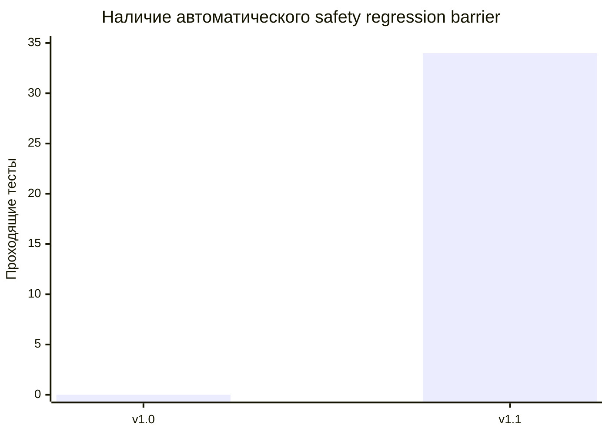
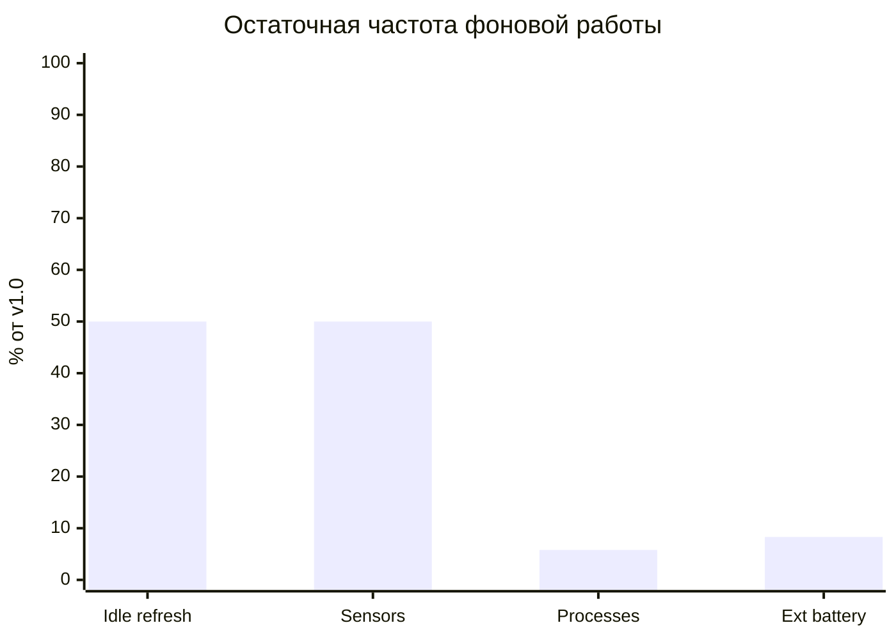
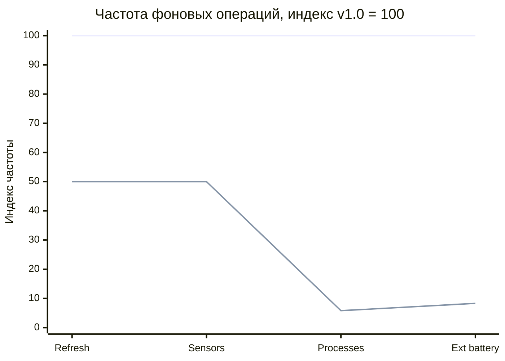
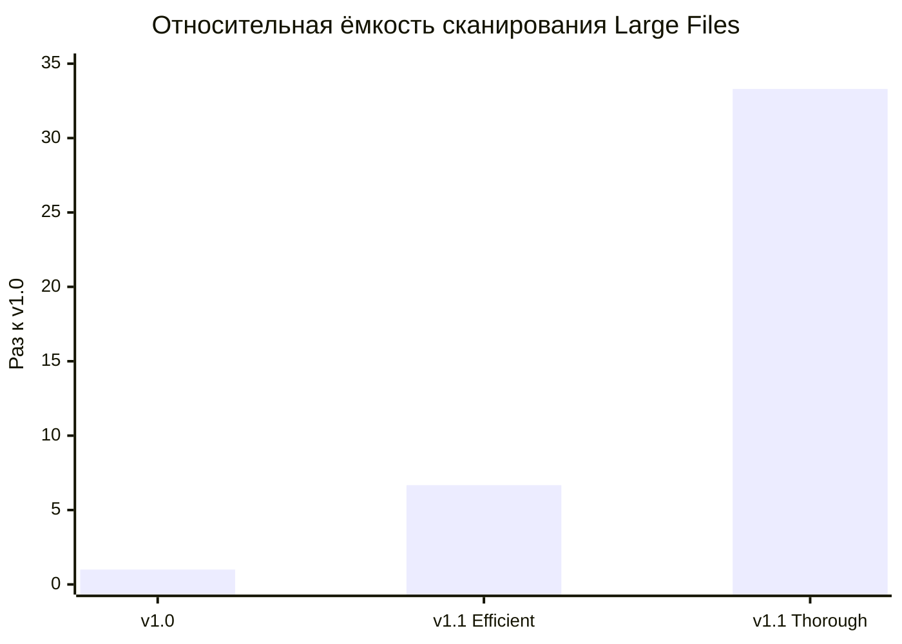
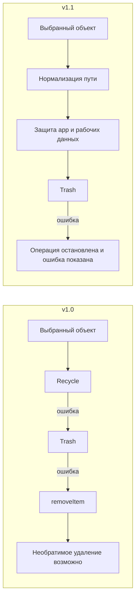
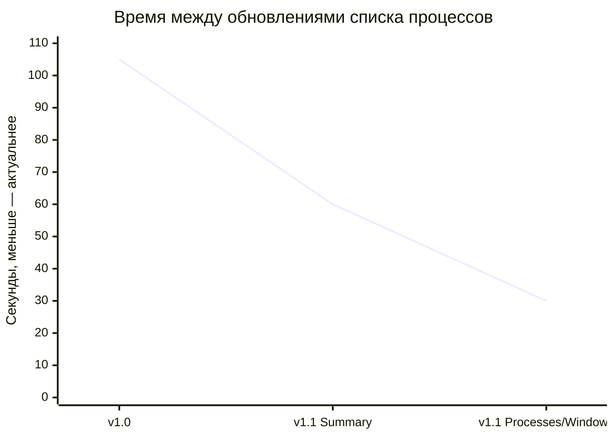
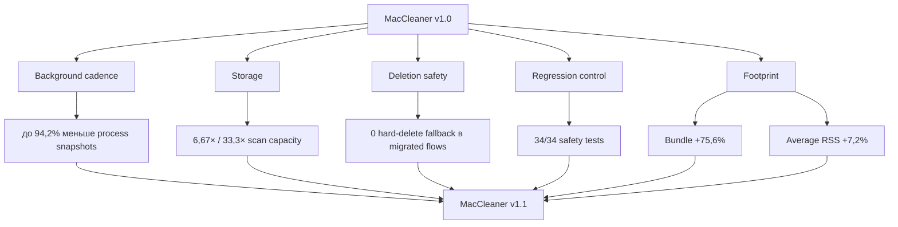

# MacCleaner v1.0 → v1.1: краткое сравнение

Дата: 2026-07-11  
Контроль: `v1.0/f629358` против `v1.1/8a9c2f0`

## Главный результат

Версия 1.1 стала существенно безопаснее, функциональнее и экономнее в фоне. Она не стала меньше: bundle вырос на 75,6%, а память запуска — примерно на 5–7%. Это осознанная цена новых анализаторов и Sparkle, но она остаётся следующей целью оптимизации.

## Сравнительная таблица

| Показатель | v1.0 | v1.1 | Результат |
|---|---:|---:|---:|
| Idle process snapshots | 1 раз / 105 сек | 1 раз / 1 800 сек | **−94,2%** |
| External battery scan | 1 раз / 30 мин | 1 раз / 6 ч | **−91,7%** |
| Idle refresh | 1 раз / 15 сек | 1 раз / 30 сек | **−50%** |
| Idle sensor scan | 1 раз / 60 сек | 1 раз / 120 сек | **−50%** |
| Processes screen freshness | 105 сек | 30 сек | **3,5× чаще** |
| Large Files entry capacity | 30 000 общий cap | 200 000 / 1 000 000 | **6,67× / 33,3×** |
| Safety tests | 0 | 34/34 | **+34, 100% pass** |
| Safe Trash call sites | разрозненные | 21 unified | Единая policy |
| Hard-delete fallback после Trash | Был | Нет в мигрированных flows | Устранён |
| High-risk entitlement | 1 | 0 | **−100%** |
| Bundle | 18,27 MiB | 32,07 MiB | **+75,6%** |
| Binary | 17,10 MiB | 28,19 MiB | **+64,9%** |
| Median average RSS | 116,65 MB | 125,10 MB | **+7,2%** |
| Median peak RSS | 126,00 MB | 131,84 MB | **+4,6%** |

## Единая диаграмма реальных тестов v1.0 и v1.1

Обе версии были собраны в Release на одном Mac и одним toolchain. Для runtime-показателей выполнено по три запуска каждой версии, по 20 выборок на запуск; на диаграмме используется медиана трёх прогонов. Значения нормализованы: результат v1.0 принят за индекс 100. Для всех пяти метрик меньше — лучше.

```mermaid
xychart-beta
    title "Release-тест: v1.0 и v1.1, индекс v1.0 = 100"
    x-axis ["Bundle", "Binary", "Avg RSS", "Peak RSS", "Startup CPU"]
    y-axis "Относительный индекс" 0 --> 180
    bar [100, 100, 100, 100, 100]
    bar [175.6, 164.9, 107.2, 104.6, 116.0]
```



Первая серия — **v1.0**, вторая — **v1.1**.

| Реальный тест | v1.0 | v1.1 | Разница |
|---|---:|---:|---:|
| Release bundle | 18 704 KiB | 32 844 KiB | **+75,6%** |
| Главный executable | 17 926 696 B | 29 558 248 B | **+64,9%** |
| Median average RSS | 116,65 MB | 125,10 MB | **+7,2%** |
| Median peak RSS | 126,00 MB | 131,84 MB | **+4,6%** |
| Median startup CPU | 8,88% | 10,30% | **+16,0%** |

Эта диаграмма честно показывает, что новые функции и Sparkle увеличили footprint. Оптимизация v1.1 проявляется не в размере Release, а в снижении фоновых операций, безопасности и отзывчивости Storage — они показаны следующими диаграммами.

### Автоматические тесты безопасности



Значение `0` для v1.0 означает **отсутствие test target**, а не 34 обнаруженные ошибки. В v1.1 test target существует и фактически завершился с результатом **34/34 passed**.

## График: снижение фоновых операций

Чем меньше, тем лучше. v1.0 принято за 100%.



## График: footprint Release

Чем меньше, тем лучше. Здесь версия 1.1 пока тяжелее.

```mermaid
xychart-beta
    title "Размер и память"
    x-axis ["Bundle MiB", "Binary MiB", "Avg RSS MB", "Peak RSS MB"]
    y-axis "Значение" 0 --> 140
    bar [18.27, 17.10, 116.65, 126.00]
    bar [32.07, 28.19, 125.10, 131.84]
```



Первая серия — v1.0, вторая — v1.1.

## Линейный график: профиль фоновой нагрузки

Индекс v1.0 принят за 100. Чем ниже линия v1.1, тем меньше фоновых запусков осталось после оптимизации.



Первая линия — v1.0, вторая — v1.1. Самое сильное снижение видно у процессов: осталось 5,8% старой фоновой частоты. Для внешней батареи осталось 8,3%.

## Точечная диаграмма: эффективность и проверяемость

Ось X показывает среднее сокращение четырёх измеренных фоновых операций: `(50 + 50 + 94,2 + 91,7) / 4 = 71,5%`. Ось Y показывает число проходящих safety-тестов, нормализованное к текущим 34 тестам.

```mermaid
quadrantChart
    title Фоновая эффективность и автоматическая проверяемость
    x-axis Низкое сокращение --> Высокое сокращение
    y-axis Нет safety-тестов --> 34 проходящих теста
    quadrant-1 Оптимизировано и проверяется
    quadrant-2 Проверяется, но требует оптимизации
    quadrant-3 Исходная точка
    quadrant-4 Быстро, но без regression barrier
    v1.0: [0.00, 0.00]
    v1.1: [0.715, 1.00]
```

Диаграмма не является субъективным рейтингом: обе координаты вычислены из cadence и результата `34/34`.

## Блочный график: расширение глубины Large Files

За единицу принят старый предел 30 000 entries.



- Efficient исследует до 200 000 entries: **в 6,67 раза больше**.
- Thorough исследует до 1 000 000 entries: **в 33,3 раза больше**.
- Рост лимита не означает обязательного роста нагрузки: оба режима ограничены deadline и могут быть отменены.

## Блочная схема: безопасность удаления



Для мигрированных пользовательских flows число предусмотренных permanent-delete fallback-путей уменьшилось с одного до нуля — **снижение на 100%**.

## Линейный график: актуальность Processes



В специализированном экране задержка уменьшилась со 105 до 30 секунд — на **71,4%**, или в **3,5 раза**.

## Карта итоговых изменений



## Что было заменено лучшим вариантом

| Было | Стало | Почему лучше |
|---|---|---|
| Общий фиксированный monitoring cadence | Cadence по активному разделу | В фоне до **94,2% меньше** тяжёлых process snapshots |
| RAM `purge` и kill ради Free RAM | Наблюдение и рекомендации без вмешательства | Нет искусственного давления и автоматической потери данных |
| Разные deletion chains | `SafeDeletionService` | Trash-only, защита данных MacCleaner, единые path rules |
| Trash → hard delete fallback | Ошибка возвращается пользователю | Неудача Trash больше не превращается в permanent delete |
| Disk Map игнорировал root | Root соблюдается | Результат соответствует выбору пользователя |
| Один скрыто ограниченный scan | Efficient / Thorough | Пользователь видит компромисс скорости и полноты |
| Повторные totals на каждом redraw | Cached derived cleanup stats | Чтение UI становится `O(1)` после rebuild |
| Storage пересоздавался при входе | Stable prewarmed workspace | Меньше зависаний при навигации |
| Отчёт занимал основной экран | Отдельный Cleanup Report sheet | Больше места инструментам |
| Нет exact/similar/cloud анализа | 3 bounded локальных анализатора | Новые способы освободить место с safety budgets |
| Нет startup regression barrier | 34 safety tests | Автоматическая проверка рискованных policies |
| Ручное обновление релизов | Sparkle + signed appcast | Быстрее доставка исправлений |

## Новые возможности

- Cleanup Advisor
- Exact Duplicates с SHA-256 verification
- Similar Photos с локальными Vision fingerprints
- Cloud Reclaim без удаления cloud-копии
- Startup Optimizer с reversible disable/restore
- Cleanup Report sheet
- Автоматические обновления Sparkle
- Общие scan budgets и safe deletion policy

## Честный итог

По безопасности, фоновой эффективности и полноте инструментов v1.1 лучше. Самый сильный численный результат — **94,2% меньше фоновых process snapshots** и **91,7% меньше запусков system_profiler** для внешней батареи. Самый заметный минус — **75,6% роста bundle** и **7,2% роста среднего RSS запуска**.

Следующая оптимизация должна сокращать footprint: удалить legacy helper, лениво загружать новые feature services и проверить launch/Storage через Instruments. Это позволит сохранить достигнутую безопасность и попытаться вернуть 5–10% памяти.
