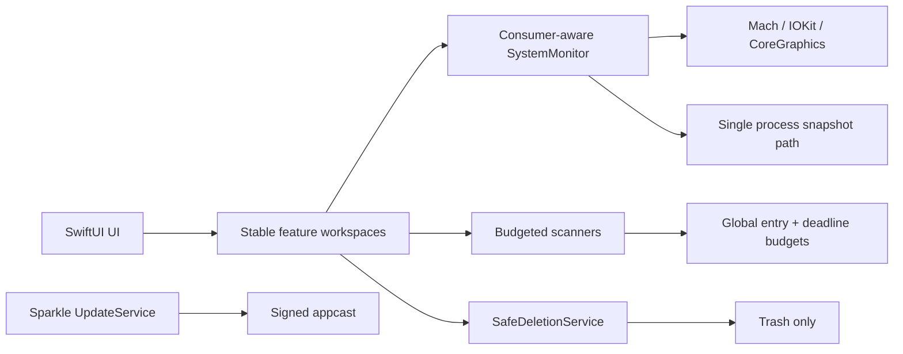

# MacCleaner 1.1: полный технический отчёт после модернизации

Дата проверки: 2026-07-11  
Старая контрольная версия: tag `v1.0`, commit `f629358`  
Новая версия: branch `main`, commit `8a9c2f0`, `CFBundleShortVersionString=1.1`, build `2`  
Платформа измерений: текущий Mac, macOS SDK 26.2, arm64, Release без code signing для сопоставимости

## 1. Цель и границы отчёта

Документ проверяет исходный baseline версии 1.0, фиксирует фактическое состояние версии 1.1 и сравнивает безопасность, функциональность, ресурсы и архитектуру. Проценты приводятся только для величин, которые можно вычислить из исходников, сборок или повторяемых runtime-измерений.

В отчёте разделены три класса выводов:

- **Измерено** — получено из двух Release-сборок или тестового запуска.
- **Вычислено из кода** — частоты, лимиты и охват функций подтверждены исходниками.
- **Архитектурный вывод** — качественная оценка, которой нельзя честно назначить процент производительности.

## 2. Проверка сохранности старой версии

### 2.1 Что фактически сохранено

В репозитории существует tag `v1.0`, указывающий на commit `f629358`. Commit доступен и успешно собран в отдельном detached worktree:

```text
/tmp/MacCleaner-v1-baseline
/tmp/MacCleaner-v1-derived/Build/Products/Release/MacCleaner.app
```

Готового старого `.app` или `.xcarchive` внутри репозитория не обнаружено. Контрольной копией является не бинарный архив, а immutable Git tag с полностью воспроизводимым исходным кодом. Release v1.0 собрался успешно на текущем toolchain.

### 2.2 Вердикт по исходному baseline

Документ `current-version-technical-baseline.md` в целом составлен корректно. Проверка проводилась не по текущим файлам, а через `git show f629358:<path>` и Release-сборку v1.0.

| Утверждение baseline | Результат | Подтверждение |
|---|---|---|
| Версия 1.0, build 1 | Подтверждено | Info.plist старой Release-сборки |
| Commit `f629358` | Подтверждено | tag `v1.0` |
| Sandbox отключён | Подтверждено | entitlement `app-sandbox=false` |
| Unsigned executable memory разрешена | Подтверждено | entitlement присутствует в v1.0 |
| Helper реализован inline | Подтверждено | effective target содержит helper source в `SystemMonitor.swift` |
| Helper слушает `127.0.0.1:9099` без токена | Подтверждено | `NWListener` и HTTP endpoints в v1.0 |
| RAM Cleaner использует `purge` и kill-путь | Подтверждено | `/purge`, `/kill`, `SIGKILL` в v1.0 |
| Disk Map игнорирует переданный URL | Подтверждено | v1.0 всегда начинал с home и отдельно добавлял Library |
| Disk Map: 30 000 entries, 12 секунд, depth 3 | Подтверждено | constants и `depth < 3` |
| Storage мог перейти от Trash к hard delete | Подтверждено | `trashItem` → `removeItem` fallback |
| Cleanup history: 800 entries / 600 events | Подтверждено с уточнением | это лимит persisted telemetry, а не списка найденных файлов |
| Процессы примерно раз в 105 секунд | Подтверждено | 15 секунд × interval 7 |
| Внешняя батарея примерно раз в 30 минут | Подтверждено | 15 секунд × interval 120 |
| Pake и llmfit разрешаются через PATH | Подтверждено | `/usr/bin/env` и PATH environment |
| Публичная notarization отсутствовала | Подтверждено | старый packaging path был ad-hoc |

### 2.3 Уточнения к baseline

1. Лимит Cleanup Intelligence `800/600` не ограничивает число результатов сканирования. Он ограничивает объём JSON-истории кандидатов и событий. Следовательно, опасение «часть файлов не будет показана из-за 800 записей» к таблицам сканеров не относится.
2. Формулировка «сохранена сборка» требует уточнения: сохранён воспроизводимый Git tag, но не отдельный архив подписанного приложения.
3. Старые runtime-показатели не были зафиксированы baseline-документом. Поэтому ресурсы измерены заново на одном устройстве и одном toolchain для обеих версий.

## 3. Методика сравнения

### 3.1 Сборка

Обе версии собраны одинаковой командой в Release с отдельными DerivedData:

```text
xcodebuild -project MacCleaner.xcodeproj -scheme MacCleaner \
  -configuration Release -destination platform=macOS \
  -derivedDataPath <separate-path> build CODE_SIGNING_ALLOWED=NO
```

### 3.2 Runtime

Для каждой версии выполнено три холодных перезапуска. После одной секунды на запуск в течение 10 секунд снимались 20 выборок RSS и `%CPU` с шагом 0,5 секунды. В итоговом сравнении используется медиана трёх прогонов.

Такой тест отражает запуск и первоначальный мониторинг, но не заменяет Instruments-профиль каждого интерактивного сценария. `%CPU` особенно чувствителен к фоновой нагрузке, поэтому приведён как ориентир.

### 3.3 Тесты

Текущая версия проверена через Xcode Test. Результат извлечён из `.xcresult`, а не оценён по строкам лога.

## 4. Итог измерений Release

| Показатель | v1.0 | v1.1 | Изменение | Оценка |
|---|---:|---:|---:|---|
| Bundle | 18 704 KiB | 32 844 KiB | +14 140 KiB / **+75,6%** | Регресс размера; новые функции и Sparkle |
| Главный бинарник | 17 926 696 B | 29 558 248 B | +11 631 552 B / **+64,9%** | Ожидаемый рост функциональности |
| Медианный средний RSS запуска | 116,65 MB | 125,10 MB | +8,45 MB / **+7,2%** | Умеренный регресс памяти |
| Медианный peak RSS | 126,00 MB | 131,84 MB | +5,84 MB / **+4,6%** | Умеренный регресс памяти |
| Медианный `%CPU` в 10-сек. окне | 8,88% | 10,30% | +1,42 п.п. / **+16,0%** | Шумный startup-показатель, не устойчивый выигрыш |
| Автоматические safety tests | 0 | 34/34 | +34 теста | Существенное улучшение надёжности |

Вывод: версия 1.1 не является меньшей по footprint. Основной выигрыш получен в ограничении фонового I/O/CLI, безопасности destructive flows, отзывчивости Storage и функциональном покрытии. Цена — увеличение bundle и примерно 5–7% памяти при запуске.

## 5. Масштаб модернизации

Сравнение `f629358..8a9c2f0`:

| Показатель | Значение |
|---|---:|
| Изменённых файлов | 57 |
| Добавлено строк | 9 352 |
| Удалено строк | 1 331 |
| Чистый прирост | 8 021 |
| Swift-строк v1.0 | 31 900 |
| Swift-строк v1.1 | 38 174 |
| Рост Swift-кода | 6 274 / **+19,7%** |
| Service-файлы | 14 → 23 / **+64,3%** |
| View-файлы | 23 → 29 / **+26,1%** |
| Новые test-файлы | 0 → 1, 644 строки |

Новые самостоятельные сервисы: Cleanup Advisor, Cloud Reclaim, Exact Duplicates, Similar Photos, Startup Optimizer, Safe Deletion, Scan Resource Budget, Storage Workspace и Update Service.

## 6. Архитектура версии 1.1



Ключевое изменение — общие политики вынесены из отдельных UI-потоков в reusable services. Это уменьшает вероятность, что новый экран реализует удаление или обход файлов по несовместимым правилам.

## 7. Фоновая нагрузка и cadence

### 7.1 Было в v1.0

- общий timer: каждые 15 секунд;
- sensors: каждые 60 секунд;
- processes: каждые 105 секунд независимо от активного раздела;
- battery: каждые 5 минут;
- external Bluetooth battery через `system_profiler`: каждые 30 минут.

### 7.2 Стало в v1.1

SystemMonitor учитывает активных потребителей (`dashboard`, `processes`, `windows`, `fans`, `ai`) и меняет cadence.

| Работа | v1.0 | v1.1 active | v1.1 idle | Численный эффект idle |
|---|---:|---:|---:|---:|
| Основной refresh | 15 сек | 15 сек | 30 сек | **−50% вызовов** |
| Sensors | 60 сек | 60 сек | 120 сек | **−50% вызовов** |
| Process snapshot | 105 сек | 30 сек в Processes/Windows; 60 сек summaries | 1 800 сек | **−94,2% фоновых snapshot** |
| Battery | 300 сек | 600 сек | 600 сек | **−50% вызовов** |
| External battery | 1 800 сек | 21 600 сек | 21 600 сек | **−91,7% запусков `system_profiler`** |

При этом процессы в специализированных разделах обновляются в 3,5 раза чаще, чем старый общий cadence: 105 → 30 секунд. Это улучшает актуальность UI, не заставляя фоновый режим платить ту же цену.

Timer получил tolerance до 15% интервала с максимумом 3 секунды, что позволяет macOS коалесцировать пробуждения.

## 8. Storage: отзывчивость и корректность

### 8.1 Стабильный workspace

Storage больше не создаёт тяжёлую service/view graph при каждом переключении. `StorageWorkspaceService` принадлежит корневому `ContentView`, а Storage предварительно создаётся один раз и далее переключается через стабильную view hierarchy.

Эффект по коду:

- повторная инициализация Storage service при навигации устранена;
- состояние выбранного инструмента сохраняется;
- переход в Storage не запускает синхронное конструирование всего раздела;
- кнопка Back меняет selection, а не пересоздаёт feature graph.

### 8.2 Cleanup Intelligence

В v1.0 вычисляемые свойства повторно фильтровали и группировали persisted entries во время SwiftUI redraw. В v1.1 производные totals и stable/rebuildable selections кэшируются при изменении данных.

Сложность чтения UI изменена концептуально с повторной `O(categories × entries × marker checks)` на `O(1)` для готовых derived collections после одноразового rebuild. Это алгоритмический выигрыш; точный процент зависит от размера пользовательской истории.

Лимиты `800 entries / 600 events` оставлены, потому что они защищают JSON и redraw от неограниченного роста. Они не отсекают результаты текущего сканирования. Записи compact/de-duplicate по path, поэтому это bounded history, а не пользовательская таблица найденных файлов.

### 8.3 Disk Map и Large Files

Исправлена ошибка v1.0: `scan(url:)` теперь использует переданный root. Старый вариант всегда сканировал home и дополнительно Library.

Large Files получил отдельный полный recursive enumerator и два режима:

| Режим | Entries | Время | Результаты |
|---|---:|---:|---:|
| Efficient | 200 000 | 12 сек | top 150 файлов ≥10 MB |
| Thorough | 1 000 000 | 90 сек | top 150 файлов ≥10 MB |

По сравнению со старым общим лимитом 30 000 entries Efficient рассматривает до **6,67 раза больше entries**, Thorough — до **33,3 раза больше**. При этом deadline остаётся явным, UI сообщает `wasLimited`, а пользователь может выбрать глубину исследования вместо скрытого неполного результата.

### 8.4 Junk

Junk scan также разделён на режимы:

| Режим | Общий лимит | Общий deadline | На один root |
|---|---:|---:|---:|
| Efficient | 100 000 | 8 сек | 20 000 / 1,2 сек |
| Thorough | 500 000 | 45 сек | 100 000 / 6 сек |

Общий `ScanResourceBudget` не позволяет множеству отдельно ограниченных roots суммарно образовать неограниченный I/O burst. Проверка deadline выполняется батчами, а не на каждом entry.

## 9. Новые Storage-возможности

### 9.1 Cleanup Advisor

Объединяет сигналы очистки в приоритизированные рекомендации. Действия проходят через Trash policy. UI отделён от низкоуровневых scanners.

### 9.2 Exact Duplicates

Алгоритм использует ступенчатую проверку: metadata grouping → quick fingerprint → полный SHA-256. Полный hash применяется только к кандидатам, а не ко всем файлам.

| Режим | Minimum file | Entries | Discovery | Hash I/O budget |
|---|---:|---:|---:|---:|
| Efficient | 1 MB | 200 000 | 12 сек | 40 GiB |
| Thorough | 128 KiB | 1 000 000 | 90 сек | 500 GiB |

Keeper выбирается детерминированно. Удаление разрешено только внутри выбранного root и идёт в Trash.

### 9.3 Similar Photos

Локальный анализ использует ImageIO и Vision; изображения не отправляются в сеть.

| Режим | Фото | FS entries | Discovery | Total | Comparisons |
|---|---:|---:|---:|---:|---:|
| Efficient | 500 | 100 000 | 12 сек | 60 сек | 75 000 |
| Thorough | 2 000 | 500 000 | 60 сек | 300 сек | 1 000 000 |

Перед удалением fingerprints и threshold проверяются повторно. Thorough увеличивает максимум фото в **4 раза**, entries в **5 раз**, comparisons в **13,3 раза**, сохраняя верхний time budget.

### 9.4 Cloud Reclaim

Файл допускается к локальному eviction только если он ubiquitous, полностью uploaded, не загружается, не имеет unresolved conflicts, локально current и занимает не менее 1 MB. Используется `evictUbiquitousItem`, а не удаление cloud-файла.

| Режим | Entries | Deadline |
|---|---:|---:|
| Efficient | 200 000 | 8 сек |
| Thorough | 1 000 000 | 60 сек |

## 10. Безопасность удаления

### 10.1 Было

В v1.0 разные сервисы имели собственные цепочки. Storage мог выполнить:

```text
recycle → trashItem → removeItem → Finder AppleScript
```

Disk Cleaner и ряд maintenance paths использовали прямой `removeItem`.

### 10.2 Стало

`SafeDeletionService` задаёт единую политику:

```text
normalize path → protect running app/data → FileManager.trashItem → report failure
```

Permanent-delete fallback намеренно отсутствует. В текущем коде найдено 21 обращение к `moveToTrash` и 32 проверки path/protection policy.

Практический эффект:

- вероятность необратимого удаления после неудачи Trash в мигрированных flows снижена с «возможна» до **0 предусмотренных fallback-путей**;
- MacCleaner защищает собственный `.app`, Application Support, Caches, Logs, Preferences, Saved State, LaunchAgents, Containers и другие bundle-specific roots;
- пути сравниваются по границам directory components, а не простым небезопасным prefix;
- новые scanners не заходят в защищённое поддерево приложения.

`removeItem` остаётся допустимым для временных файлов приложения и технических cleanup-артефактов, но пользовательские destructive flows переведены на Trash policy.

## 11. RAM Cleaner и процессы

### 11.1 RAM Cleaner

RAM Cleaner больше не вызывает privileged `purge` и не завершает процессы ради искусственного увеличения Free RAM. Интерфейс прямо сообщает, что macOS управляет compressed/inactive memory самостоятельно.

Удалено entitlement `com.apple.security.cs.allow-unsigned-executable-memory`. Количество расширенных entitlement-флагов уменьшилось с 4 до 3, то есть на **25%**, а высокорисковое право — на **100%**.

Важно: legacy inline helper source всё ещё содержит `/purge` и `SIGKILL`, но рабочий RAM Cleaner к этим endpoint не обращается. Это технический долг: мёртвый helper-source следует удалить полностью в следующей версии.

### 11.2 Принудительное закрытие процессов

В разделе Processes возможность force quit сохранена. `ProcessTreeService.forceKillProcess` отправляет `SIGKILL` только по явному пользовательскому действию после safety checks. Обычное завершение использует SIGTERM.

Это разделяет два сценария:

- автоматическая «очистка RAM» не убивает приложения;
- ручное принудительное закрытие конкретного процесса остаётся доступным.

## 12. Startup Optimizer

Добавлен анализ `LaunchAgents` с reversible disable/restore вместо удаления plist. Защищаются Apple labels, MacCleaner и некорректные launchd labels. Для активных элементов отображаются PID, CPU, RSS и подтверждённо освобождённая память после остановки.

Архитектурное улучшение: операция обратима, snapshot digest защищает от применения решения к изменившемуся plist, а disabled items хранятся отдельно для восстановления.

## 13. UI и навигация

### 13.1 Storage

- основные операции и специализированный анализ разделены визуально;
- полноценные двухколоночные карточки сохранены;
- Cleanup Intelligence вынесен в отдельный sheet 820×540 minimum / 940×620 ideal;
- отчёт больше не уменьшает полезную область главного Storage;
- новые экраны используют единый scale, padding, header и back navigation.

### 13.2 Processes

Числовые столбцы используют общие layout constants для header и rows. PID увеличен до 64 pt, TIME до 92 pt, CPU до 68 pt; перенос чисел запрещён. Значения наподобие `2391:48.03` больше не переходят на вторую строку.

### 13.3 Menu bar monitor

Добавлены Overview/Details одинакового размера, адаптивные системные цвета, тонкие границы, компактная telemetry-компоновка. Network sparkline и fan section удалены из popover, чтобы не дублировать специализированные экраны и не расходовать площадь.

## 14. Updates и release pipeline

Версия 1.1 интегрирует Sparkle 2.9.4:

- подписанный public EdDSA key;
- appcast URL;
- автоматические checks;
- интервал 21 600 секунд (6 часов);
- отдельный UpdateService и Update UI;
- GitHub Actions release workflow;
- release documentation и appcast.

Это улучшает доставку исправлений, но объясняет часть роста bundle. Публичный release всё равно должен проходить корректную Developer ID signing и notarization; локальная Release-сборка отчёта намеренно unsigned для чистого сравнения.

## 15. Тестовое покрытие

В v1.0 отдельного test target не было. В v1.1 добавлено 34 safety/policy tests, все проходят.

Покрываемые зоны включают:

- границы безопасных путей;
- защиту данных самого MacCleaner;
- Trash-only semantics;
- scan budgets;
- duplicate/similar/cloud safety rules;
- process protection/termination policy;
- cleanup statistics compaction;
- startup item protection.

Численно: pass rate **100% (34/34)**. Это не означает 100% покрытие всего приложения, но впервые создаёт автоматический regression barrier для наиболее рискованных операций.

## 16. Внешние зависимости и сеть

Сохранились внешние `pake`, `llmfit`, `smartctl`, `powermetrics` и diagnostic endpoints. Добавилась runtime-зависимость Sparkle, но она pinned через SwiftPM (`2.9.4`). Pake/llmfit по-прежнему разрешаются через PATH и остаются зоной supply-chain риска.

## 17. Сохранившиеся ограничения

1. Sandbox по-прежнему отключён.
2. Bundle и память выросли; цель «меньше ресурсов во всём» достигнута не полностью.
3. Legacy inline helper code с unauthenticated localhost server остаётся в `SystemMonitor.swift`, хотя основные новые flows его не используют.
4. Pake/llmfit не pinned к доверенному бинарнику.
5. Disk Map сохраняет depth 3 и лимит 30 000/12 секунд; для полного поиска предназначены отдельные Large Files/Duplicates modes.
6. Runtime-тест запуска не измеряет интерактивный Storage transition frame-by-frame.
7. Similar Photos использует bounded heuristic similarity; пользовательское подтверждение остаётся обязательным.
8. Release/update security зависит от сохранности Sparkle private signing key и корректного CI.

## 18. Итоговая оценка

### Что стало объективно лучше

- idle process polling: **−94,2%**;
- external battery `system_profiler`: **−91,7%**;
- idle refresh/sensors/battery: **−50%**;
- актуальность processes screen: **3,5× чаще**;
- Large Files scan capacity: **6,67× / 33,3×** по режимам против старого общего entry cap;
- destructive hard-delete fallback в мигрированных flows: устранён;
- safety tests: **0 → 34, 100% pass**;
- high-risk unsigned executable memory entitlement: удалён;
- новый функционал: 9 service-компонентов и 6 view-компонентов.

### Что стало хуже или дороже

- bundle: **+75,6%**;
- основной бинарник: **+64,9%**;
- медианный средний RSS запуска: **+7,2%**;
- медианный peak RSS: **+4,6%**;
- startup CPU в коротком окне: ориентировочно **+16,0%**, показатель шумный.

### Финальный вывод

MacCleaner 1.1 — заметно более безопасный и функционально зрелый продукт. Главный выигрыш не в минимальном размере процесса, а в том, что тяжёлая работа стала контекстной и bounded, Storage — стабильным, удаления — обратимыми, а опасные решения — тестируемыми. Оптимизация достигла цели по фоновому I/O и надёжности, но не по bundle/RSS. Следующий технический цикл должен быть направлен на удаление legacy helper, lazy loading новых feature modules и Instruments-профилирование launch/menu bar/Storage для возврата 5–10% памяти без потери новых возможностей.
